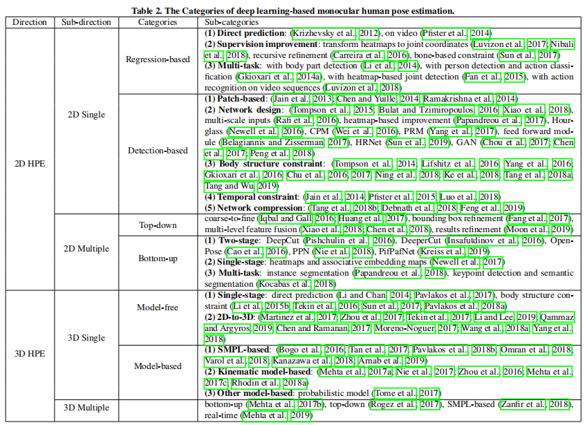
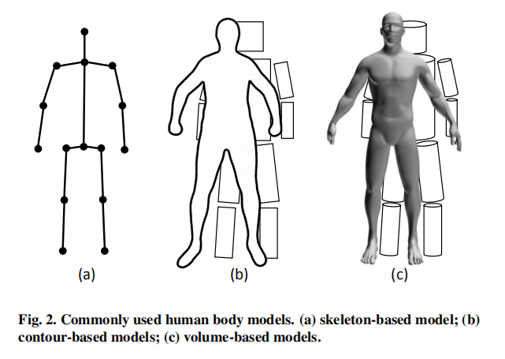
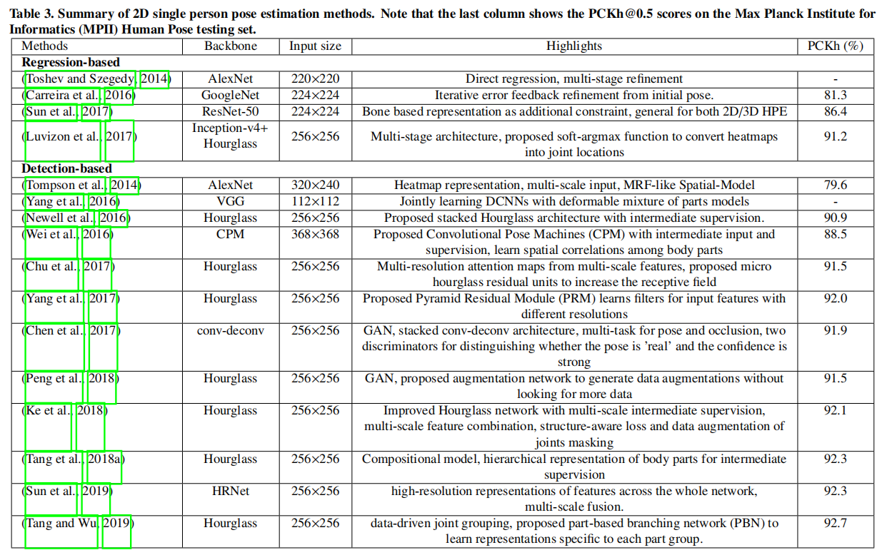

# 人体姿态估计（持续更新中...）

---

> 参考博客：
>
> [基于深度学习的人体姿态估计综述：全面调研（2014-2020）](https://zhuanlan.zhihu.com/p/339527650)
>
> [人体姿态估计综述（Human Pose Estimation）](https://zhuanlan.zhihu.com/p/331564848)
>
> [重新思考人体姿态估计 Rethinking Human Pose Estimation](https://zhuanlan.zhihu.com/p/72561165?utm_source=wechat_session)
>
> [人体姿态估计的过去，现在，未来](https://zhuanlan.zhihu.com/p/85506259)
>
> [简述 Human Pose with Deep-learning](https://zhuanlan.zhihu.com/p/345201439)
>
> [基于CNN的2D多人姿态估计论文综述](https://zhuanlan.zhihu.com/p/106762065)

## 生成方法与判别方法

生成方法和判别方法之间的主要区别是方法是否使用人体模型。根据人体模型的不同表示，可以以不同的方式处理生成方法，例如关于人体模型结构的先验知识，从不同视图到2D或3D空间的几何投影，高维参数化空间回归方式的优化。

判别方法直接学习从输入源到人体姿势空间的映射（基于学习）或搜索不存在的示例（基于示例），而无需使用人体模型。 判别方法通常比生成方法要快，但对于从未受过训练的姿势而言，判别方法的鲁棒性较差。

## 回归方法与检测方法

基于回归的方法将输入图像直接映射到人体关节的坐标或人体模型的参数。 

基于检测的方法基于两种广泛使用的表示将身体部位作为检测目标：图像块（image patches）和关节位置的热图。

从图像到关节坐标的直接映射非常困难，因为它是一个高度非线性的问题，而小区域表示则提供了具有更强鲁棒性的密集像素信息。 与原始图像尺寸相比，小区域表示的检测结果限制了最终关节坐标的准确性。

## 人体模型

## 2D单人姿态估计

### 回归方法

仅使用关节，不包含周围邻域信息，缺乏鲁棒性

结合heatmap监督和数值坐标监督，可以保留两种方式的优势

1. Soft Argmax：《Human pose regression by combining indirect part detection and contextual information》
2. DSNT: 可微分空间数值转换：《Numerical coordinate regression with convolutional neural networks》

直接从很少受约束的输入图像中预测关节坐标非常困难，因此，通过改进或人体模型结构引入了功能更强大的网络

1. Iterative Error Feedback network：《Human pose estimation with iterative error feedback》
2. 结构感知回归方法：代替使用关节来表示姿势，而是通过涉及身体结构信息来设计基于骨骼的表示，以实现比仅使用关节位置更稳定的结果。《Compositional human pose regression》

与人体相关的多任务学习

1. 以回归方式处理来自完整图像的联合坐标预测任务，并使用滑动窗口获得的图像块进行身体部位检测任务。《Heterogeneous multi-task learning for human pose estimation with deep convolutional neural network》
2. 使用R-CNN架构来同步进行人体检测，以及动作分类。《R-cnns for pose estimation and action detection》
3. 双源（dual-source）CNN：使用图像块和全图像进行输入《Combining local appearance and holistic view: Dual-source deep neural networks for human pose estimation》
4. 共同处理视频序列中的2D / 3D姿势估计和动作识别：《2d/3d pose estimation and action recognition using multi-task deep learning》

### 检测方法

...待补充

## 2D多人姿态估计

