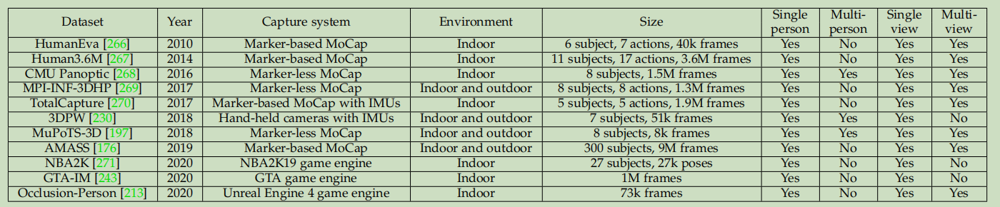
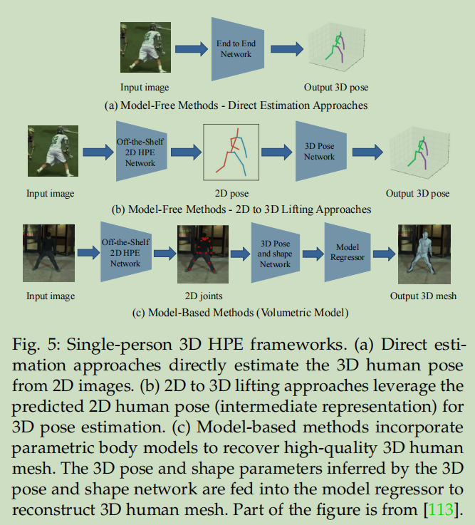
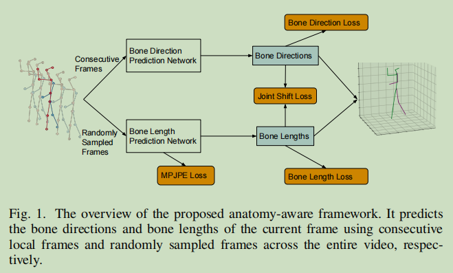
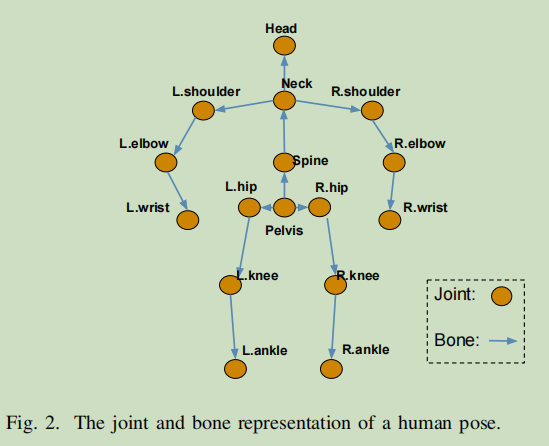
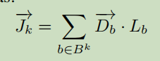
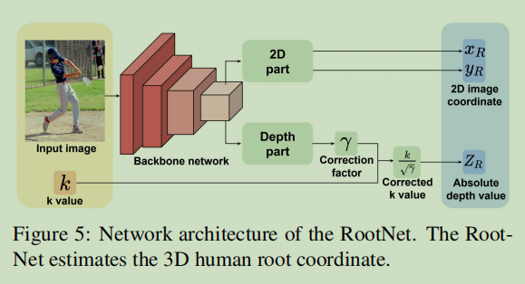

# 3D人体姿态估计

> 博客：
>
> [基于深度学习的人体姿态估计综述：全面调研（2014-2020）](https://zhuanlan.zhihu.com/p/339527650)
>
> [人体姿态估计综述（Human Pose Estimation）](https://zhuanlan.zhihu.com/p/331564848)
>
> [2020 Pose Estimation人体骨骼关键点检测综述笔记（有空更新）](https://zhuanlan.zhihu.com/p/69042249)
>
> [3D Pose Estimation关键点检测的算法整理（2020）](https://zhuanlan.zhihu.com/p/164603050)
>
> 论文:
>
> 《Camera Distance-aware Top-down Approach for 3D Multi-person Pose Estimation from a Single RGB Image》
>
> 《**Integral Human Pose Regression**》

## Datasets

| 数据集               | 数量       |      |
| -------------------- | ---------- | ---- |
| **HumanEva Dataset** | 40k frames |      |
| MPI-INF-3DHP         |            |      |
| Human3.6M            |            |      |

## 评价指标

### **MPJPE**

 (Mean Per Joint Position Error)

### 

## 单人3D pose

### model-free

1. 直接预测方法
2. 2d-3D转换方法

#### Anatomy3D

> 论文《Anatomy-aware 3D Human Pose Estimation with Bone-based Pose Decomposition 》

1. 将3D关键点预测转换为关节长度预测与关节方向预测
2. 提出分层关节方向预测网络
3. 高效关节长度预测网络
4. 利用2D可见度分数改善深度模型性

关节的3D向量 = 方向向量·长度

#### RootNet

> 论文: 《**Camera Distance-aware Top-down Approach for 3D Multi-person Pose**  Estimation from a Single RGB Image》

#### 待续。。。

先在PaperReadding泛读

再在综述中详细阅读

### model-based

3D human mesh

## 多人3D Pose

### Top-Down

### Bottom-Up

