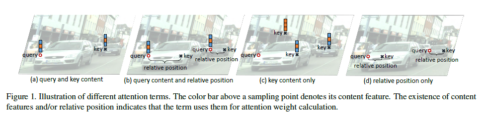
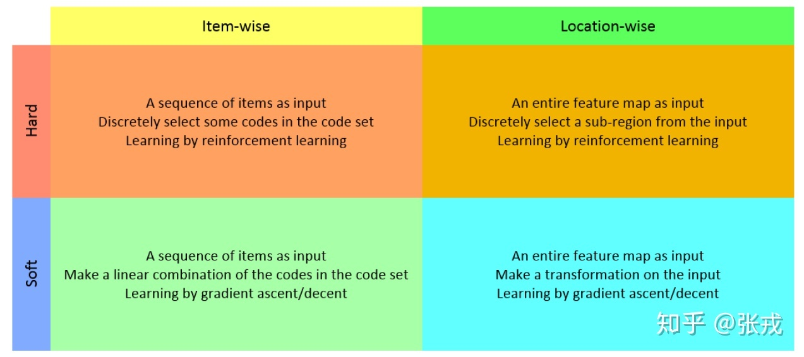
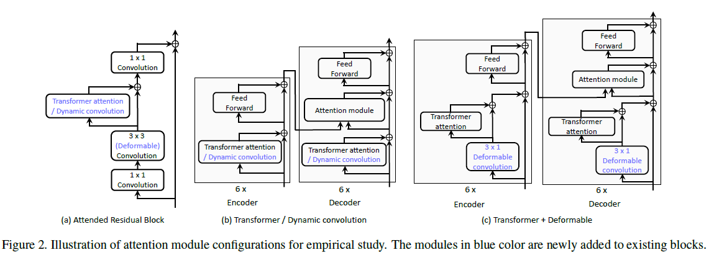
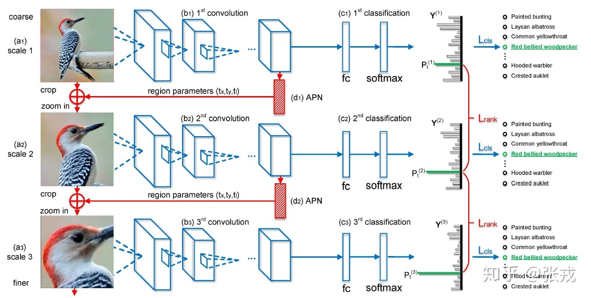

# Attention

---

> 论文：《An Empirical Study of Spatial Attention Mechanisms in Deep Networks》
>
> 参考博客：
>
> [计算机视觉中的注意力机制](<https://zhuanlan.zhihu.com/p/56501461>)
>
> [微软亚研：对深度神经网络中空间注意力机制的经验性研究](<https://www.jiqizhixin.com/articles/2019-04-15-12>)

## 四个可能的注意力因素

## 注意力机制的种类

## Spatial Attention Mechanisms

## 关键论文

### 1. 《Look Closer to See Better：Recurrent Attention Convolutional Neural Network for Fine-grained Image Recognition》

Attention Proposal Sub-Network（APN）。这个 APN 结构是从整个图片（full-image）出发，迭代式地生成子区域，并且对这些子区域进行必要的预测，并将子区域所得到的预测结果进行必要的整合，从而得到整张图片的分类预测概率 

### 2. 《Multiple Granularity Descriptors for Fine-grained Categorization》

### 3. 《Recurrent Models of Visual Attention》