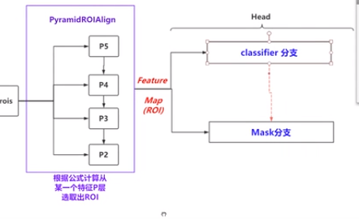

# Mask RCNN

---

>参考资料
>
>[令人拍案称奇的Mask RCNN](<https://zhuanlan.zhihu.com/p/37998710>)
>
>[知乎：如何评价 Kaiming He 最新的 Mask R-CNN?](<https://www.zhihu.com/question/57403701>)
>
>[实例分割--Mask RCNN详解](<https://blog.csdn.net/qinghuaci666/article/details/80900882>)
>
>[B站视频：Mask R-CNN 深度解读与源码解析](<https://www.bilibili.com/video/av24795835?from=search&seid=5700274980241297444>)
>
>论文：
>
>《[Feature Pyramid Networks for Object Detection](https://arxiv.org/abs/1612.03144)》
>
>《Mask R-CNN》
>
>源码：
>
>[[matterport]/**Mask_RCNN**](<https://github.com/matterport/Mask_RCNN>)

---

算法需要解决四个问题，其一是图像分类 (image classification)，主要回答是什么的问题，其二是定位 (localization)，主要回答在哪里的问题，其三是mask classification，即对图像中每个像素做分类，进一步回答了在哪里的问题，其四是关键点定位，在进一步回答在哪里的同时也包含了更多是什么的信息。


## 基本架构

ResNet-FPN+Fast RCNN+mask

主要的改进点：

1. 基础网络的增强：FPN
2. 分割loss的改进：由原来的 FCIS 的 基于单像素softmax的多项式交叉熵变为了基于单像素sigmod二值交叉熵
3. ROI Align层的加入
4. 添加并列的FCN层，即Mask层




### FPN

引入FPN是对主干网络的主要扩展


FPN产生了特征金字塔 $[P2,P3,P4,P5,P6]​$，而并非只是一个feature map。金字塔经过RPN之后会产生很多region proposal

Top-Down + Bottom-Up

FPN结构中包括自下而上，自上而下和横向连接三个部分


1. 自下而上

特征提取的过程

2. 自上而下

从最高层开始进行上采样，采用最近邻上采样而不是反卷积，既简单又可以减少训练参数

3. 横向连接

将上采样的结果和自底向上的相同大小的feature map进行融合；

具体就是经过1*1卷积之后，和上采样的feature map进行整合；

融合之后还要采用3*3卷积对融合特征进行处理，目的是消除混叠


> **上图少绘制了一个分支**：M5经过步长为2的max pooling下采样得到 P6，作者指出使用P6是想得到更大的anchor尺度512×512。但P6是只用在 RPN中用来得到region proposal的，并不会作为后续Fast RCNN的输入。
>
> ResNet-FPN作为RPN输入的feature map是P2~P6 ，而作为后续Fast RCNN的输入则是P2~P5

根据经验公式来决定不同尺度的ROI要从哪个$P_k​$来切


大尺度的ROI要从低分辨率的feature map上切，有利于检测大目标，小尺度的ROI要从高分辨率的feature map上切，有利于检测小目标


### Mask分支

[FCN](<https://zhuanlan.zhihu.com/p/22976342>)

与FasterRCNN相比，Mask-RCNN多了一个分支；Mask-RCNN将RCNN拓展到语义分割领域

Mask-RCNN的实现是FCN网络，掩码分支实际就是一个卷积网络，选择ROI分类器的正样本作为输入，生成对应的掩码


网络架构：

1. 骨干网络ResNet-FPN，用于特征提取，另外，ResNet还可以是：ResNet-50,ResNet-101,ResNeXt-50,ResNeXt-101；
2. 头部网络，包括边界框识别（分类和回归）+mask预测。头部结构见下图


Mask RCNN定义多任务损失：$L=L_{cls}+L_{box}+L_{mask}$

### ROI Align

Faster RCNN 中采用的是ROI pooling 特征图和原始图并不是对准的，misalignment

1. 双线性插值：本质是在两个方向做线性插值


虚线表示feature map；实线表示ROI；这里将ROI分成2*2的单元格

如果采样点是4，那么首先将每个单元格分成4块，每块的中心点就是采样点

对每个采样点就行双线性插值，得到采样点处的值；

然后对每个单元格中的4个采样点进行maxpooling


### 损失函数

$$ L=L_{cls}+L_{box}+L_{mask}$$

损失函数 = 分类损失+检测损失+分割损失

假设一共有K个类别，则mask分割分支的输出维度是 $K*m*m$ , 对于 中$m*m​$的每个点，都会输出K个二值Mask（每个类别使用sigmoid输出）

> 计算loss的时候，并不是每个类别的sigmoid输出都计算二值交叉熵损失，而是该像素属于哪个类，哪个类的sigmoid输出才要计算损失(如图红色方形所示)
>
> 并且在测试的时候，我们是通过分类分支预测的类别来选择相应的mask预测。这样，mask预测和分类预测就彻底解耦了
>
> 通过对每个 Class 对应一个 Mask 可以有效避免类间竞争


## 源码阅读

> B站视频
>
> [[matterport]/**Mask_RCNN**](<https://github.com/matterport/Mask_RCNN>): Keras + Tensorflow实现
>
> [maskrcnn-benchmark](<https://github.com/facebookresearch/maskrcnn-benchmark>): pytorch 1.0 ， 包含faster rcnn


1. 学习mask rcnn loss的计算

网络结构包括：

+ backbone
+ rpn
+ ROIheads:  包括roi_box_head，roi_mask_head， roi_keypoint_head


mask score只在正例上计算；

mask rcnn 创建targets需要labels和masks


每一个类别分支都有对应的m*m mask

分割误差为新的东西，对于每一个ROI，mask分支定义一个K*m*2维的矩阵表示K个不同的分类对于每一个m*m的区域，对于每一个类都有一个。对于每一个像素，都是用sigmod函数进行求相对熵，得到平均相对熵误差Lmask。对于每一个ROI，如果检测得到ROI属于哪一个分类，就只使用哪一个分支的相对熵误差作为误差值进行计算

二值交叉熵

`F.binary_cross_entropy_with_logits`


roi——mask_predictor

```python
# 调用
self.loss_evaluator = make_roi_mask_loss_evaluator(cfg)
loss_mask = self.loss_evaluator(proposals, mask_logits, targets)

# mask loss计算类
class MaskRCNNLossComputation(object):
    def __init__(self, proposal_matcher, discretization_size):
        """
        Arguments:
            proposal_matcher (Matcher): 
            	包括前景iou阈值、背景iou阈值，附加low-quality matches
            discretization_size (int)：
            	离散尺寸，分辨率？
        """
        self.proposal_matcher = proposal_matcher
        self.discretization_size = discretization_size

    def match_targets_to_proposals(self, proposal, target):
        # 为每个proposal分配targets
        
        match_quality_matrix = boxlist_iou(target, proposal)
        matched_idxs = self.proposal_matcher(match_quality_matrix)
        # Mask RCNN needs "labels" and "masks "fields for creating the targets
        target = target.copy_with_fields(["labels", "masks"])
        # get the targets corresponding GT for each proposal
        # NB: need to clamp the indices because we can have a single
        # GT in the image, and matched_idxs can be -2, which goes
        # out of bounds
        matched_targets = target[matched_idxs.clamp(min=0)]
        matched_targets.add_field("matched_idxs", matched_idxs)
        return matched_targets

    def prepare_targets(self, proposals, targets):
        #
        
        
        labels = []
        masks = []
        
        for proposals_per_image, targets_per_image in zip(proposals, targets):
            # 为proposal分配targets
            matched_targets = self.match_targets_to_proposals(
                proposals_per_image, targets_per_image
            )
            matched_idxs = matched_targets.get_field("matched_idxs")

            labels_per_image = matched_targets.get_field("labels")
            labels_per_image = labels_per_image.to(dtype=torch.int64)

            # this can probably be removed, but is left here for clarity
            # and completeness
            
            neg_inds = matched_idxs == Matcher.BELOW_LOW_THRESHOLD
            labels_per_image[neg_inds] = 0

            # mask scores are only computed on positive samples
            positive_inds = torch.nonzero(labels_per_image > 0).squeeze(1)

            segmentation_masks = matched_targets.get_field("masks")
            segmentation_masks = segmentation_masks[positive_inds]

            positive_proposals = proposals_per_image[positive_inds]

            masks_per_image = project_masks_on_boxes(
                segmentation_masks, positive_proposals, self.discretization_size
            )

            labels.append(labels_per_image)
            masks.append(masks_per_image)

        return labels, masks

    def __call__(self, proposals, mask_logits, targets):
        """
        Arguments:
            proposals (list[BoxList])
            mask_logits (Tensor)
            targets (list[BoxList])

        Return:
            mask_loss (Tensor): scalar tensor containing the loss
        """
        labels, mask_targets = self.prepare_targets(proposals, targets)

        labels = cat(labels, dim=0)
        mask_targets = cat(mask_targets, dim=0)

        positive_inds = torch.nonzero(labels > 0).squeeze(1)
        labels_pos = labels[positive_inds]

        # torch.mean (in binary_cross_entropy_with_logits) doesn't
        # accept empty tensors, so handle it separately
        if mask_targets.numel() == 0:
            return mask_logits.sum() * 0

        mask_loss = F.binary_cross_entropy_with_logits(
            mask_logits[positive_inds, labels_pos], mask_targets
        )
        return mask_loss


    
# mask loss 评价器
def make_roi_mask_loss_evaluator(cfg):
    matcher = Matcher(
        cfg.MODEL.ROI_HEADS.FG_IOU_THRESHOLD,
        cfg.MODEL.ROI_HEADS.BG_IOU_THRESHOLD,
        allow_low_quality_matches=False,
    )

    loss_evaluator = MaskRCNNLossComputation(
        matcher, cfg.MODEL.ROI_MASK_HEAD.RESOLUTION
    )

    return loss_evaluator
```


2. 使用Retinanet

代码路径：`/maskrcnn_benchmark/modeling/rpn/retinanet`


## 拓展 Mask Scoring R-CNN


[Mask Scoring R-CNN](<https://blog.csdn.net/weixin_40955254/article/details/88605164>)

[CVPR2019:Mask Scoring R-CNN](<https://zhuanlan.zhihu.com/p/58291808>)

