# 人体姿态估计Paper Reading

---

## 2D单人姿态估计

### 20210219：《Deeply learned compositional models for human pose estimation》

身体部位的分层表示

人体姿态估计存在的难点

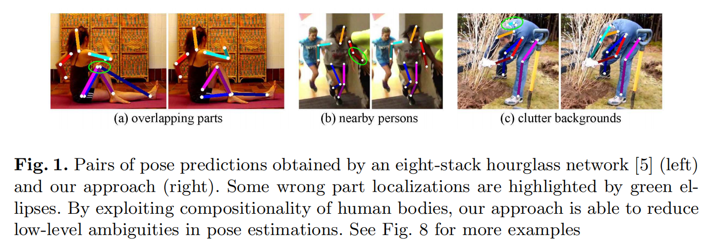

解决方案：

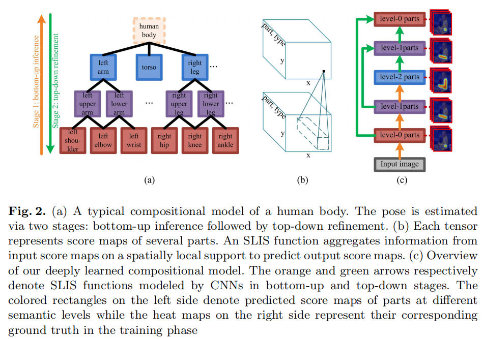

1. DLCMs-Compositional models
   + 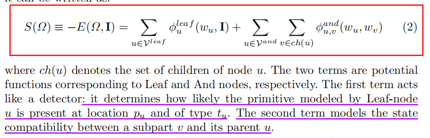
   + 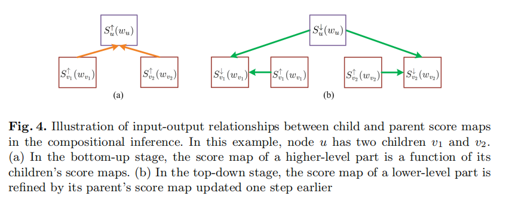
2. SLIS- Spatially local information summarization
   + 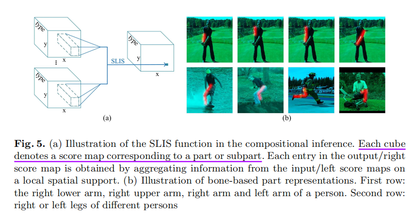
3. 基于骨架得表示方法-Bone-based part representation
   + 
4. 结构化的网络结构

### 20210219：《Does learning specific features for related parts help human pose estimation》

基于零件的分层网络

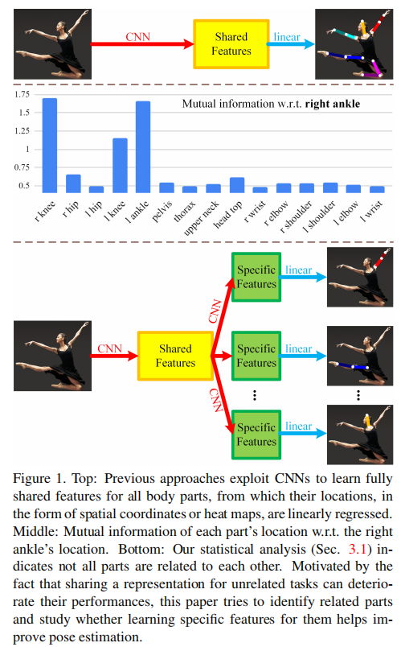

找出不同关节部位之间的相关性

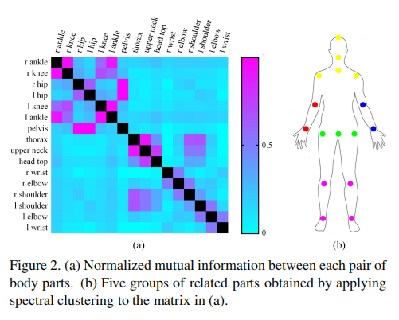

PBN模型

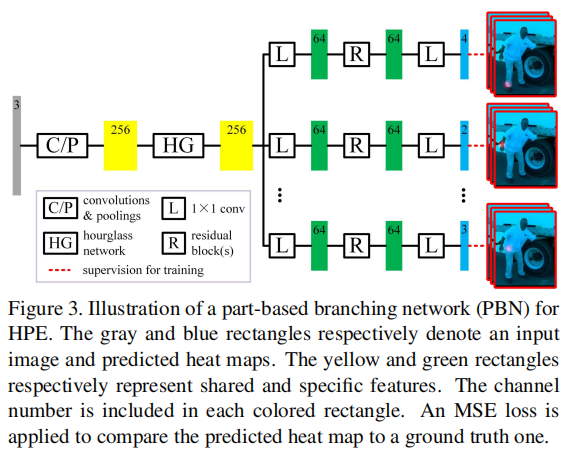

stack-PBN

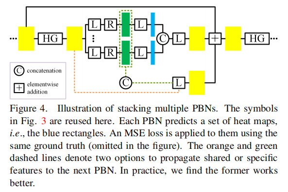

### 20210220：《**Human Pose Estimation for Real-World Crowded Scenarios**》

真实拥挤场景下的人体姿态估计

需研究[代码](https://github.com/thomasgolda/Human-Pose-Estimation-for-Real-World-Crowded-Scenarios)可见点/遮挡点如何分配，和计算loss???

1. 人工合成遮挡：
   - 被物体遮挡：利用coco分割标注
   - 被人遮挡：1. 只截取部分身体 2. 遮挡人体贴在边界附近
2. OccNet/OccNetCB：
   - 

### 20210224: 《UniPose: Unified Human Pose Estimation in Single Images and Videos》

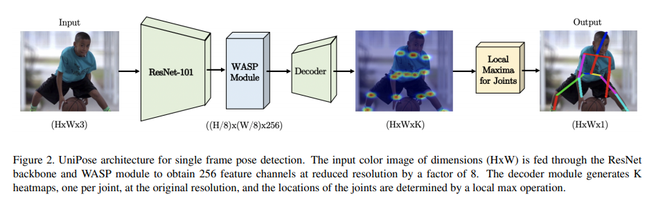

WASP-Waterfall Atrous Spatial Pooling

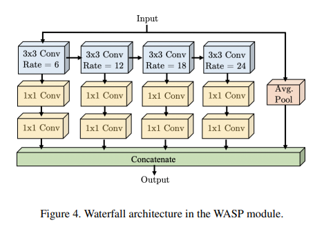

UniPose Decoder

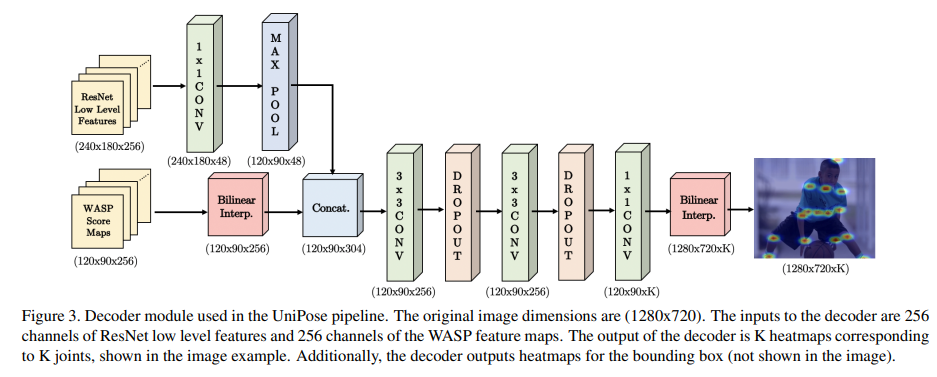

### 20210224：《TRB: A Novel Triplet Representation for Understanding 2D Human Body》

试图同时表示人体骨架与人体形状，但数据咋办？

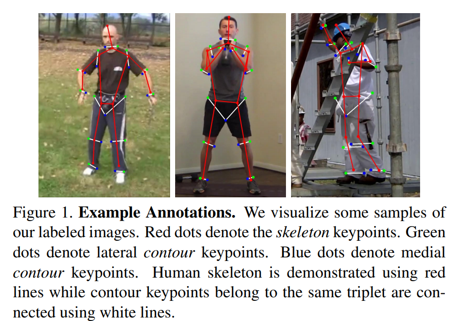

## 2D多人姿态估计

### 20210221：《CrowdPose: Efficient Crowded Scenes Pose Estimation and A New Benchmark》

### 20210221：《Associative Embedding:End-to-End Learning for Joint Detection and Grouping》

1. 什么是associative embedding?
2. 怎么计算？
3. 有什么作用？

### 20210221：《PifPaf: Composite Fields for Human Pose Estimation》

1. pifpaf如何计算

   

### 20210224：《15 Keypoints Is All You Need》

### 20210224：《Peeking into occluded joints: A novel framework for crowd pose estimation》

能否解决遮挡或关键点错乱？？

1. **OCPose**遮挡数据集
2. OPEC-Net框架

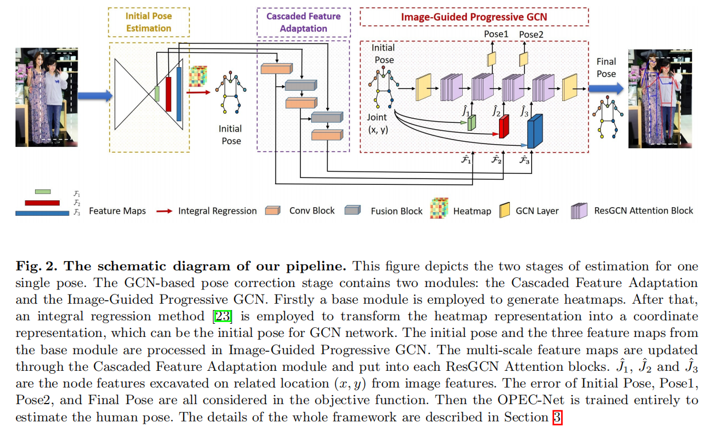

### 20210224：《EfficientHRNet-Efficient and Scalable High-Resolution Networks for
Real-Time Multi-Person 2D Human Pose Estimation》

总结hrnet系列：见   人体姿态估计之HRNet系列.md

与EfficientPose啥区别

### 20210304：《Multi-Hypothesis Pose Networks: Rethinking Top-Down Pose Estimation》

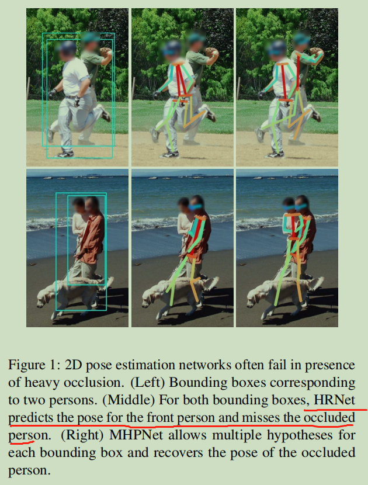

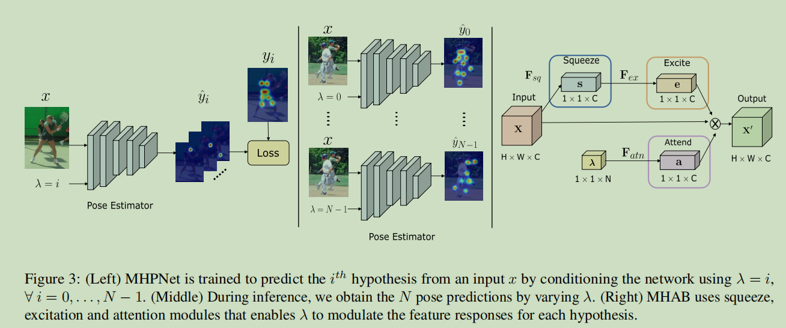

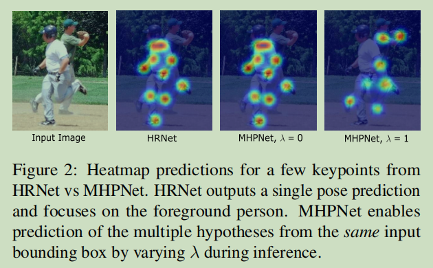

## 3D人体姿态估计

### 20210329：《**3D human pose estimation in video with temporal convolutions and semi-supervised training** 》

[github工程代码](https://github.com/facebookresearch/VideoPose3D)

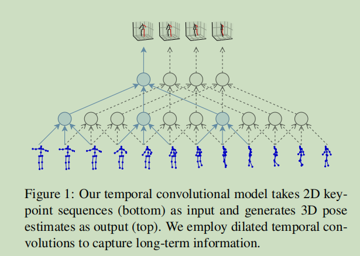

