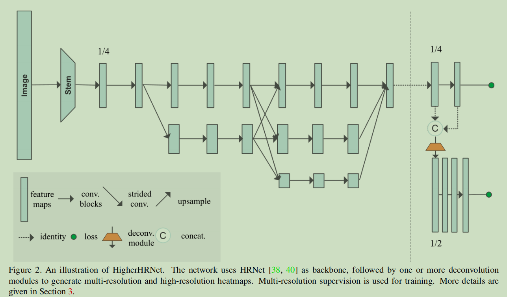
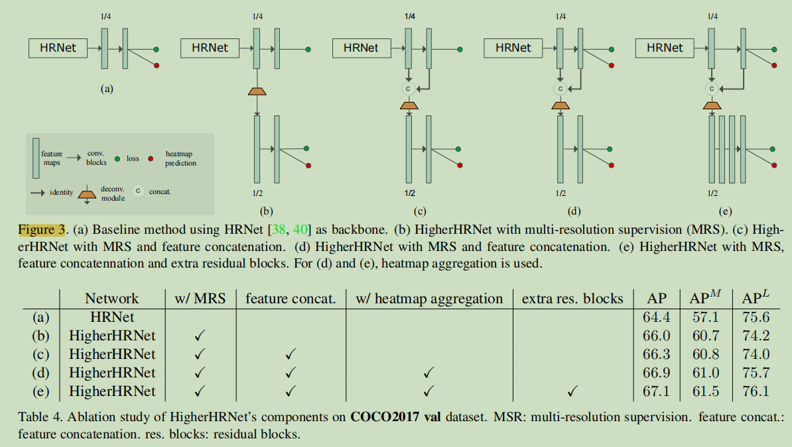
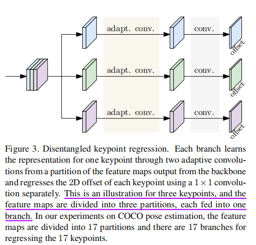
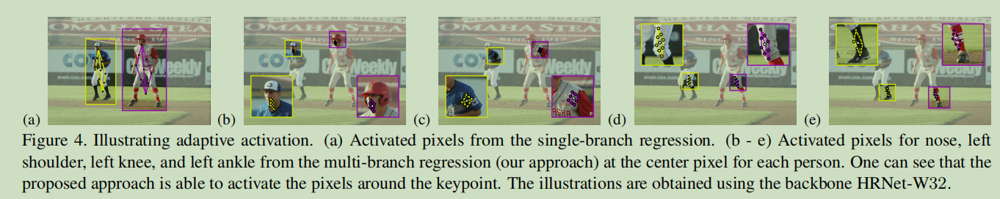
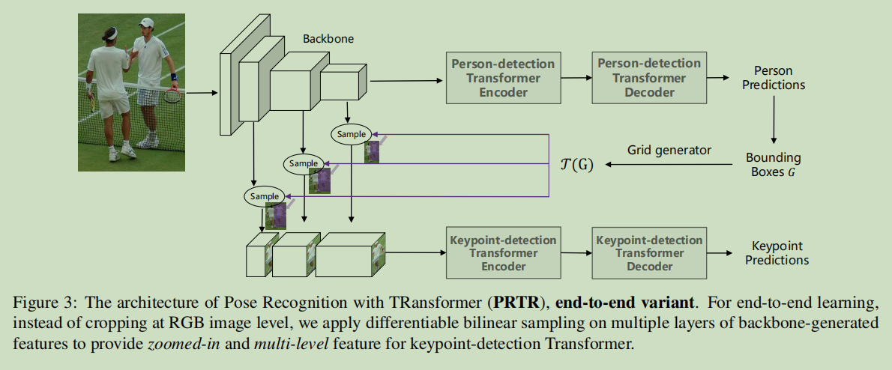
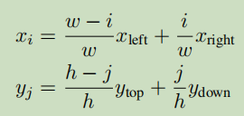
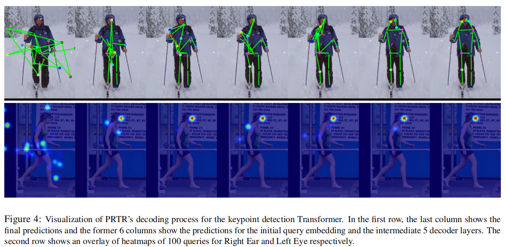
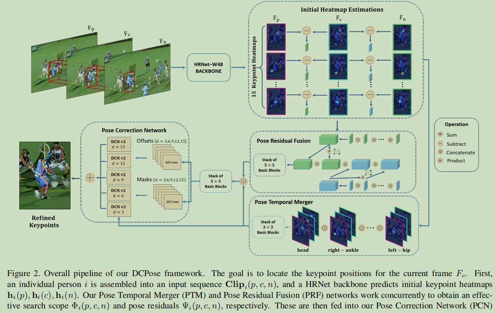
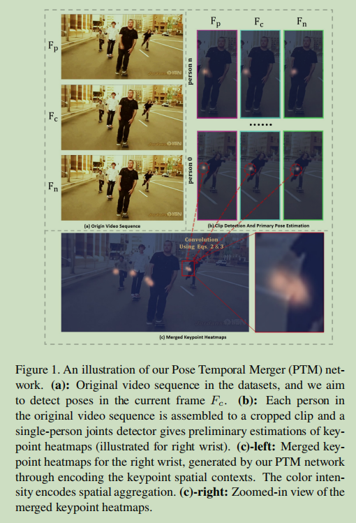

# 人体姿态估计-5月

---

Paper Reading系列目标为论文泛读，了解论文创新点即可

## 2D Pose

### 20210524：《**Numerical Coordinate Regression with Convolutional Neural Networks**》

详细见另一篇博客...

### 20210524：《**HigherHRNet: Scale-Aware Representation Learning for Bottom-Up Human Pose Estimation**》

由于尺度变化，bottom-up方法难以预测小目标人体姿态

解决小目标问题，主要有两个难点：

+ 尺度变化，如何不牺牲大目标的精度
+ 如何生成高质量高分辨率特征

>当输入尺度增大，小目标效果改善，但大目标效果下降

higher-hrnet使用高分辨率金字塔学习尺度感知表示，训练时使用多分辨率监督，测试时使用多分辨率聚合，作者称higher-hrnet对中等目标人体也有较大改善，对crowdpose拥挤目标也比较鲁棒

作者采用Associative embedding方法预测tagmap

作者认为引入高斯核会影响关键点精度的准确性，减小标准差能有所缓解，但会导致难以训练

作者采用在不同分辩率上标准差不变（默认为2）的高斯分布，用以预测更高分辩率的heatmap(1/2)，作者认为1/4分辩率的heatmap不足

> 保持标准差不变：不同分辨率用以预测不同尺度上关键点，高分辨率特征图上，一个相对更小的标准差，用于更精确预测小目标人体

作者并没有对金字塔不同层，指定不同尺度的人体，而是让模型自动分辨不同尺度的目标

+ 本文相对hrnet只有两层特征金字塔，FPN有4层，结构差异
+ 由于高斯核，gt关键点相互耦合，难以解耦

tagmap需要全局推理且在1/2层难以学习收敛，因此只在最低的分辩率1/4上预测

推理阶段：作者通过双线性插值将不同尺度上的heatmap恢复到输入尺寸，然后平均

这种方式，能够综合不同尺度的结果

作者feature map聚合和heatmap聚合实验

### 20210510：《**Bottom-Up Human Pose Estimation Via Disentangled Keypoint Regression**》

disentangled keypoint regression (DEKR)

+ 作者提出要准确回归关键点坐标，需要关注关键点附近区域
+ 通过像素级spatial transformer实现adaptive convolutions
+ 多分支结构，每个分支负责一个关键点

采用centernet方式，在每个人体目标预测一个像素中心，然后预测2K个偏置，等价于fc直接回归？

使用adaptive conv关注关键点区域：

### TODO-20210422：《RMPE: Regional Multi-person Pose Estimation》

### TODO-20210422: 《Multi-Person Pose Estimation for PoseTrack with Enhanced Part Affinity Fields》

## 领域自适应

### TODO-20210406：《**Regressive Domain Adaptation for Unsupervised Keypoint Detection**》

## 3D pose

### 20210511：《Anatomy-aware 3D Human Pose Estimation with Bone-based Pose Decomposition 》

1. 将3D关键点预测转换为关节长度预测与关节方向预测
2. 提出分层关节方向预测网络
3. 高效关节长度预测网络
4. 利用2D可见度分数改善深度模型性

关节的3D向量 = 方向向量·长度

## Transformer

### 20210420：《AN IMAGE IS WORTH 16X16 WORDS: TRANSFORMERS FOR IMAGE RECOGNITION AT SCALE》

### 20210420：《Swin Transformer: Hierarchical Vision Transformer using Shifted Windows》

### 20210523：《**Pose Recognition with Cascade Transformers**》

Pose Regression TRansformers

+ 通过级联Transformer实现基于回归的人体姿态识别
+ 作者提出两阶段的级联transformer以及使用spatial transformer的端到端序列化方式
+ 对不同层可视化关键点分布

两阶段类似于top-down方法：DETR+PRTR

端到端方式:

crop操作对于边框坐标可微：wxh是关键点 transformer期望的feature map大小

使用了不同中间层的多尺度特征（使用双线性核），双线性采样细节？（尚未明白）

PRTR的解码过程

......

## PoseTrack

视频多帧人体姿态估计

### 20200524：《**Deep Dual Consecutive Network for Human Pose Estimation**》

作者提出DCPose（dual consecutive pose estimation framework）	

作者设计了三个模块

+ PTM：a novel Pose Temporal Merger network，聚合多帧，获取搜索空间
+ PRF：a Pose Residual Fusion network ，获取姿态残差
+ PCN：a Pose Correction Network，通过融合的heatmap和pose残差，生成微调后的heatmap

PTM

