# yolov5

---

> [深入浅出Yolo系列之Yolov5核心基础知识完整讲解](https://zhuanlan.zhihu.com/p/172121380)
>
> [深入浅出Yolo系列之Yolov3&Yolov4&Yolov5核心基础知识完整讲解](https://zhuanlan.zhihu.com/p/143747206)

## YOLOv3/YOLOv4回顾

### YOLOv3

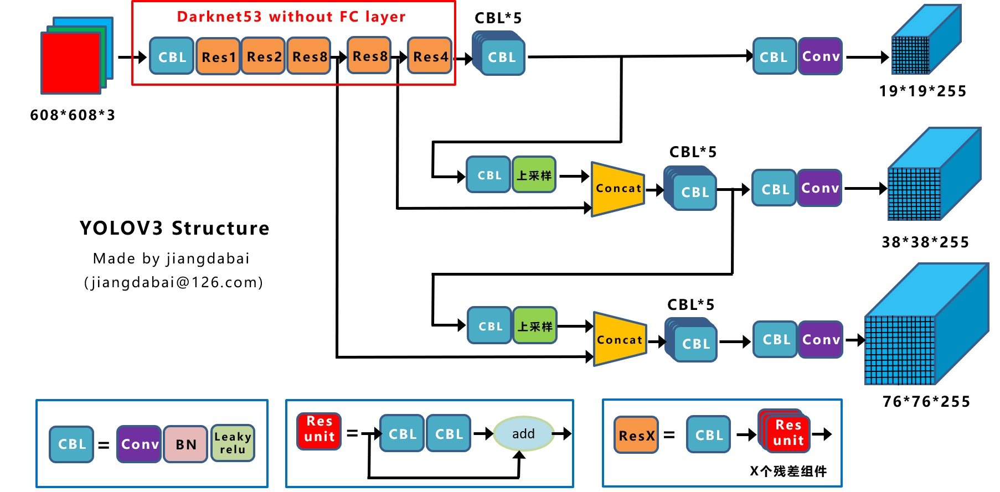

### YOLOv4

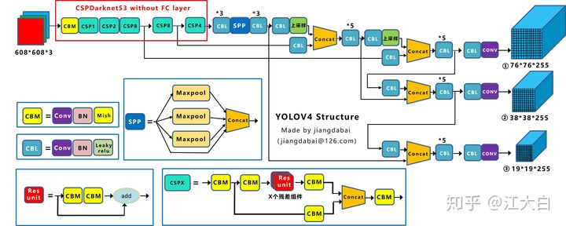

1. **输入端：**这里指的创新主要是训练时对输入端的改进，主要包括**Mosaic数据增强、cmBN、SAT自对抗训练**
2. **BackBone主干网络：**将各种新的方式结合起来，包括：**CSPDarknet53、Mish激活函数、Dropblock**
3. **Neck：**目标检测网络在BackBone和最后的输出层之间往往会插入一些层，比如Yolov4中的**SPP模块**、**FPN+PAN结构**
4. **Prediction：**输出层的锚框机制和Yolov3相同，主要改进的是训练时的损失函数**CIOU_Loss**，以及预测框筛选的nms变为**DIOU_nms**

#### Mosaic数据增强

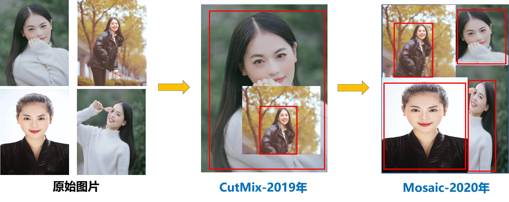

#### CSPDarknet53

Cross Stage Paritial Network

CSPNet的作者认为推理计算过高的问题是由于网络优化中的**梯度信息重复**导致的。

#### Mish激活函数

#### DropBlock

中间Dropout的方式会随机的删减丢弃一些信息，但**Dropblock的研究者**认为，卷积层对于这种随机丢弃并不敏感，因为卷积层通常是三层连用：**卷积+激活+池化层**，池化层本身就是对相邻单元起作用。而且即使随机丢弃，卷积层仍然可以从相邻的激活单元学习到**相同的信息**

因此，在全连接层上效果很好的Dropout在卷积层上**效果并不好**。

所以**右图Dropblock的研究者**则干脆整个局部区域进行删减丢弃。

这种方式其实是借鉴**2017年的cutout数据增强**的方式，cutout是将输入图像的部分区域清零，而Dropblock则是将Cutout应用到每一个特征图。而且并不是用固定的归零比率，而是在训练时以一个小的比率开始，随着训练过程**线性的增加这个比率**

#### SPP

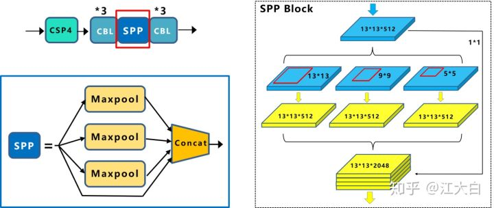

**注意：**这里最大池化采用**padding操作**，移动的步长为1，比如13×13的输入特征图，使用5×5大小的池化核池化，**padding=2**，因此池化后的特征图仍然是13×13大小

#### FPN+PAN

yoloV3-FPN

yoloV4-PAN

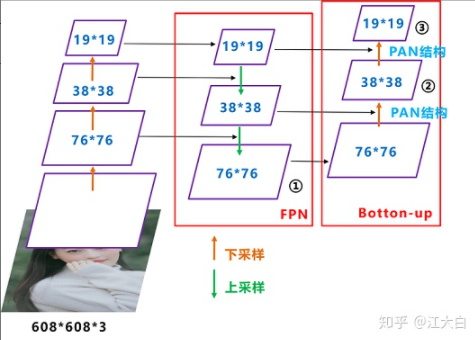

#### Loss

**Smooth L1 Loss-> IoU Loss（2016）-> GIoU Loss（2019）-> DIoU Loss（2020）->CIoU Loss（2020）**

IOU:

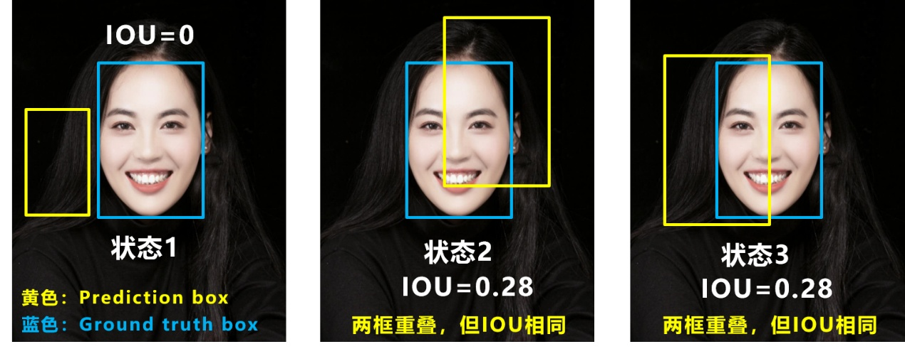

1. 无iou时，loss=0不可导，无法反传
2. iou相同，可能相交情况不同

GIOU：

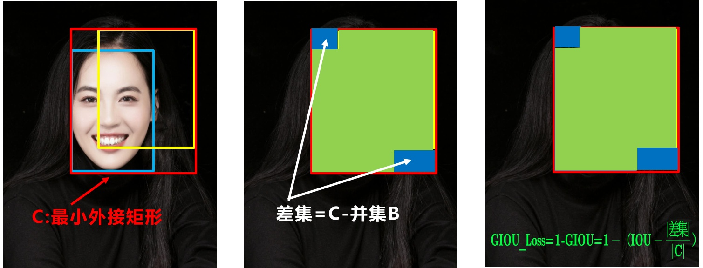

状态1、2、3都是预测框在目标框内部且预测框大小一致的情况，这时预测框和目标框的差集都是相同的，因此这三种状态的**GIOU值**也都是相同的，这时GIOU退化成了IOU，无法区分相对位置关系。

**DIOU**:

+ **最小化预测框和目标框之间的归一化距离**
+ **在预测框和目标框重叠时，回归的更准确**

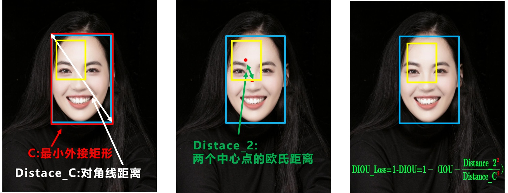

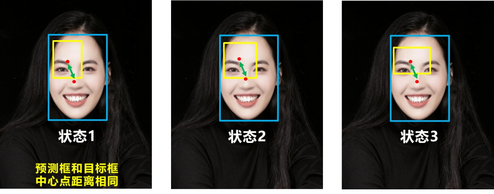

问题：没考虑长宽比

CIOU：

在此基础上还增加了一个影响因子，将预测框和目标框的长宽比都考虑了进去

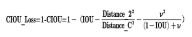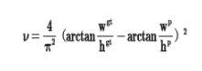

综上所述：

**IOU_Loss：**主要考虑检测框和目标框重叠面积。

**GIOU_Loss：**在IOU的基础上，解决边界框不重合时的问题。

**DIOU_Loss：**在IOU和GIOU的基础上，考虑边界框中心点距离的信息。

**CIOU_Loss：**在DIOU的基础上，考虑边界框宽高比的尺度信息。

### YOLOv5

#### Mosiaic 数据增强

#### **自适应锚框计算**

#### **自适应图片缩放**

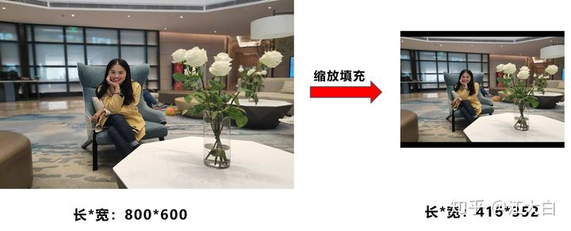

对原始图像**自适应的添加最少的黑边**，保证32的倍数即可 

结合源码的原理解析

#### box计算方式的不同

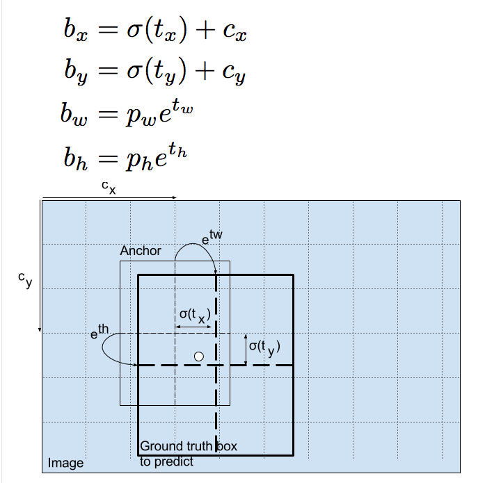

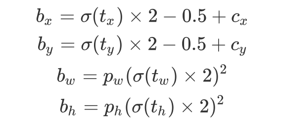