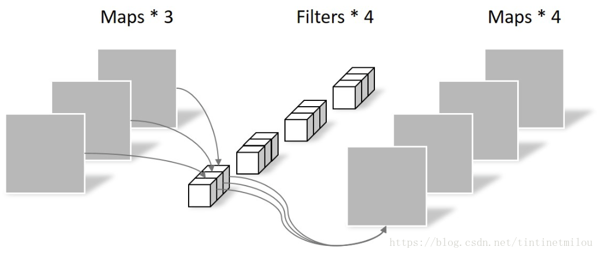

# BlazeFace

---

>参考博客: 
>
>[Depthwise卷积与Pointwise卷积](<https://blog.csdn.net/tintinetmilou/article/details/81607721>)
>
>[基于tensorflow的BlazeFace-lite人脸检测器](<https://zhuanlan.zhihu.com/p/79047443>)
>
>[2019最新论文阅读-BlazeFace:面向移动设备的实时人脸检测](<https://zhuanlan.zhihu.com/p/73550375>)
>
>[实战嵌入端的AI算法](<https://zhuanlan.zhihu.com/c_1124983270429036544>)
>
>代码：
>
>
>  

---

## 深度可分离卷积 

不同于常规卷积操作，Depthwise Convolution的一个卷积核负责一个通道，一个通道只被一个卷积核卷积。

Pointwise Convolution的运算与常规卷积运算非常相似，它的卷积核的尺寸为 1×1×M，M为上一层的通道数。所以这里的卷积运算会将上一步的map在深度方向上进行加权组合，生成新的Feature map。

## MobileNet

MobileNetV3综合了以下几个模型的优点：

+ MobileNetV1的深度可分离卷积（depthwise separable convolutions）
+ MobileNetV2的具有线性瓶颈的逆残差结构(the inverted residual with linear bottleneck)
+ MnasNet的基于squeeze and excitation结构的轻量级注意力模型

## BlazeFace

### 增大感受野大小

### 特征提取

### anchor 改进

