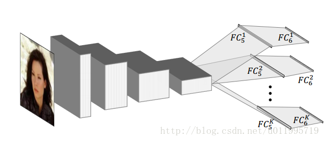
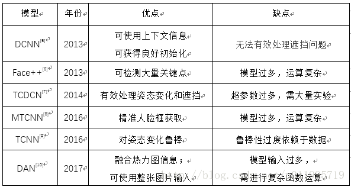

# 人脸关键点检测

---

> 参考资料：
>
> [人脸关键点检测综述](<https://zhuanlan.zhihu.com/p/42968117>)
>
> [深度学习人脸关键点检测方法----综述](<https://blog.csdn.net/u011995719/article/details/78890333>)
>
> 
>
> 论文：
>
> 《An Empirical Study of Recent Face Alignment Methods》

---

[TOC]

## 人脸关键点检测简介

### 检测方法分类

+ 基ASM(Active Shape Model) 和AAM (Active Appearnce Model)的传统方法
+ 基于级联形状回归的方法
+ 基于深度学习的方法

按照参数化与否进行划分

里程碑式的五种方法：

1. 1995年，Cootes的ASM(Active Shape Model)。 
2. 1998年，Cootes 的AAM(Active Appearance Model)算法。 
3. 2006年，Ristinacce 的CLM（Constrained Local Model）算法。 
4. 2010年，Rollar 的cascaded Regression算法。 
5. 2013年，Sun开创深度学习人脸关键点检测的先河，首次将CNN应用到人脸关键点定位

### 评价标准：

算法所获取的关键点位置与真实关键点位置之间的偏差。

 目前主流的方法是基于两眼间的距离进行人脸大小的标准化，即：

 
其中分子 表示估计值与真实值的欧式距离，分母 表示双眼距离，即两眼中心的欧式距离

### 关键点数量

## 经典模型

### ASM (Active Shape Models)  与 AAM（Active Appearance Models） 
### CPR（Cascaded pose regression） 
### DCNN 

属于级联回归方法

DCNN采用级联回归的思想，从粗到精的逐步得到精确的关键点位置，不仅设计了三级级联的卷积神经网络，还引入局部权值共享机制，从而提升网络的定位性能。

### Face++版DCNN 

### TCDCN 

### MTCNN 

### TCNN（Tweaked Convolutional Neural Networks） 

### DAN（Deep Alignment Networks）

### 小结

## 轻量化模型

### 级联MobileNetV2

level_1 进行粗略的关键点定位；依据 level_1 输出的关键点进行人脸区域裁剪，获得人脸区域图像作为 level_2 的输入，最终关键点定位信息由 level_2 进行输出。

MobileNetV2:

### 常见轻量化模型

[纵览轻量化卷积神经网络：SqueezeNet、MobileNet、ShuffleNet、Xception](<https://www.jiqizhixin.com/articles/2018-01-08-6>)

+ MobileNet

+ ShuffleNet

+ SqueezeNet

fire module = squeeze层+expand层

squeeze 层，该层采用 1*1 卷积核对上一层 feature map 进行卷积，主要目的是减少 feature map 的维数

Expand 层分别用 1*1 和 3*3 卷积，然后 concat

+ Xception