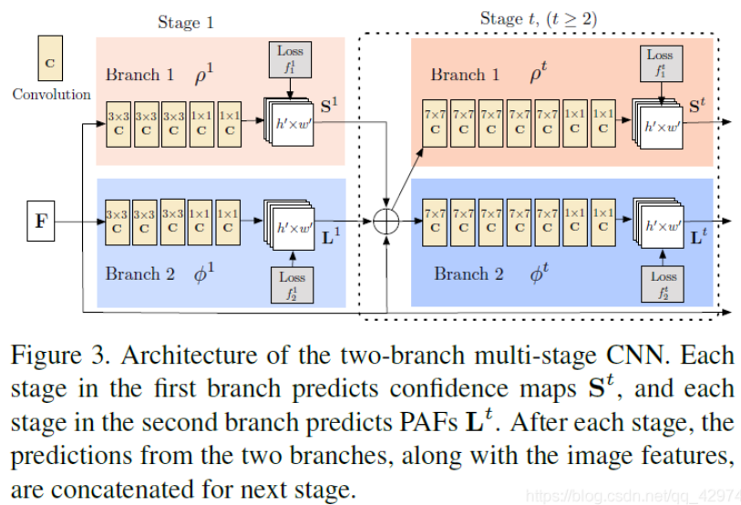
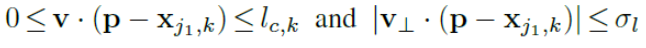
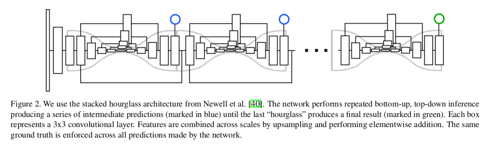
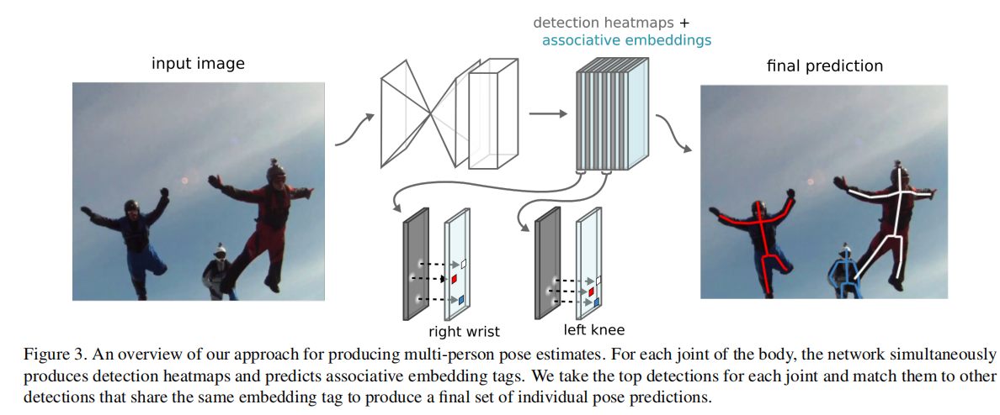

# 人体姿态估计之BottomUp

---

>[2020人体姿态估计综述（Part1：2D Single Person）](https://blog.csdn.net/qq_42974561/article/details/108025390)
>
>[2020人体姿态估计综述（Part2：2D Top-Down Multi-Person Pose Estimation）](https://blog.csdn.net/qq_42974561/article/details/108030150)
>
>[2020人体姿态估计综述（Part3：2D Bottom-Up Multi-Person Pose Estimation）](https://blog.csdn.net/qq_42974561/article/details/108091561)

---

目前主流的Bottom Up主要有以下三种方法：

+ 一个是类似于Associative Embedding，预测每个关节点属于哪个人，这种group的方式比较直接；
+ 另一个是Openpose的，我不管这是谁的关节点，我只要合理组合，就能最终形成每个人的姿态；
+ 还有一个是centernet这种，预测关节点相对于root的offset，借助root来进行group

## OpenPose-PAF

+ 前一项就是算j1->p的向量在v上的投影长度是否小于肢体真实长度，
+ 后一项算的是p在v的垂直方向投影长度是不是小于阈值，阈值自己设置，所以PAF其实是一个矩形形状的向量场

## Associative embedding

Associative embedding End-to-end learning for joint detection and grouping

作者让每个stage的输出是heatmap+tag map，tag map的值代表了这个图上的每个像素点属于哪一个人，这里的值并不是0，1，2，3这样子，而可能是1，5，9，12这样，最后组合的时候，只要把tag数值最接近的一堆关节点分配到一起就可以构成一个人的完整姿态了

## PersonLab

## CenterNet

## HigherHRNet

