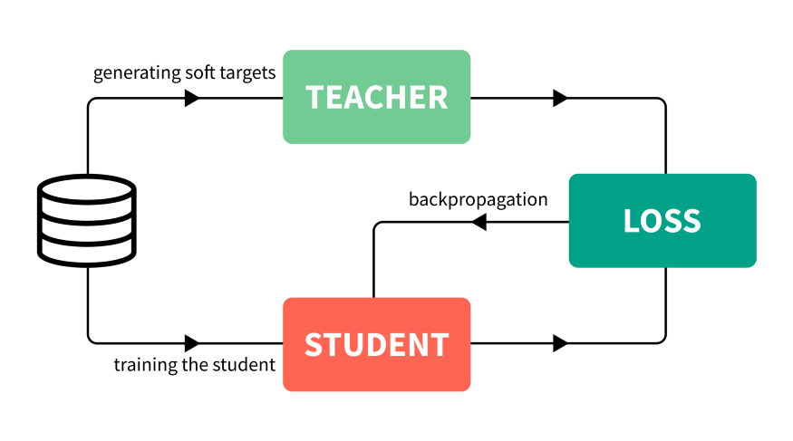
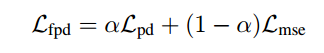

# 知识蒸馏

---

> 论文：
>
> 《Fast Human Pose Estimation》
>
> 《Distilling the Knowledge in a Neural Network》
>
> 博客：
>
> [知识蒸馏：如何用一个神经网络训练另一个神经网络](https://zhuanlan.zhihu.com/p/265906295)

## 知识蒸馏

## Fast Human Pose Estimation

loss设置

为什么加入teacher网络？

1. 人体关节点容易被标错在遮挡很严重的图片里
2. 密集场景或遮挡场景下的难样本,比如太复杂而人体不容易标出
3. 还有一个就是原有的label可能并没有标出来. 例如人坐在凳子上, 脚踝点刚好位于图片边缘,label可能就没有这个点,而teacher model可以学习到
4. 模型直接从ground truth学,可能很难收敛,但加入teacher model的预测值