# 人体关键点

> 博客：
>
> [Pose Estimation Overview](<https://www.jianshu.com/p/58fa25c73d5d>)
>
> [awesome-human-pose-estimation](<https://github.com/cbsudux/awesome-human-pose-estimation>)
>
> [A 2019 guide to Human Pose Estimation with Deep Learning](<https://nanonets.com/blog/human-pose-estimation-2d-guide/?utm_source=reddit&utm_medium=social&utm_campaign=pose&utm_content=GROUP_NAME>)
>
> [计算机视觉方向简介 | 人体骨骼关键点检测综述](<https://blog.csdn.net/c2a2o2/article/details/85111755>)
>
> [2019人体骨骼关键点检测综述笔记](<https://zhuanlan.zhihu.com/p/69042249>)
>
> [人体姿态估计（人体关键点检测）分类与经典方法分析（附GitHub地址）](<https://zhuanlan.zhihu.com/p/56016574>)
>
> [学习CVPR 2019 论文《用于人体姿态估计的深度高分辨率表示学习》（HRNets）](<https://zhuanlan.zhihu.com/p/65442640>)
>
> [从DeepNet到HRNet，这有一份深度学习“人体姿势估计”全指南](<https://zhuanlan.zhihu.com/p/64938651>)
>
> [卷积神经网络的网络结构——Hourglass](<https://blog.csdn.net/u013841196/article/details/81048237>)
>
> [Stacked Hourglass Networks简析](<https://zhuanlan.zhihu.com/p/65123312>)
>
> [基于CNN的2D单人体姿态估计论文综述](<https://zhuanlan.zhihu.com/p/106760005>)
>
> 视频：
>
> [【极市】张锋-2D单人人体姿态估计及其应用](<https://www.bilibili.com/video/av19006542/>)

---

## Hourglass

> 论文《Stacked Hourglass Networks for Human Pose Estimation》
>
> 博客：[2D关键点检测之CPM：Convolutional Pose Machines](<https://zhuanlan.zhihu.com/p/102468356>)

### 沙漏hourglass设计

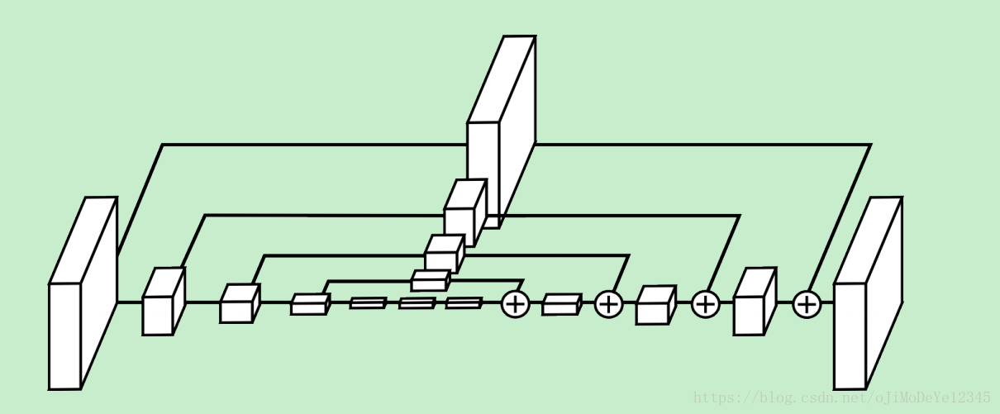

## CPM

> 论文《Convolutional Pose Machines》

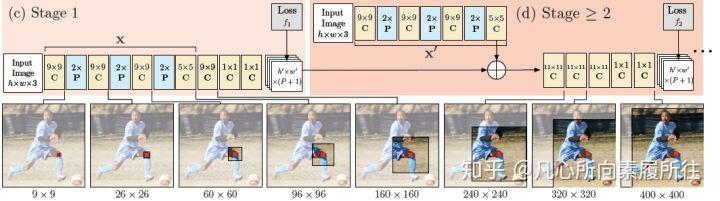

### 问题

1. 什么是姿态机？

   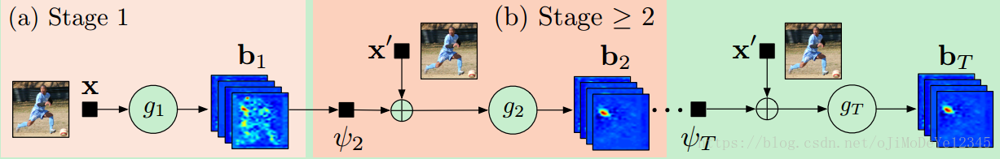

2. 什么是卷积姿态机？

3. 第一阶段与后续阶段的区别？

   a. 在每个人的相应部件位置，放置高斯响应。（下图左）
   b. 只在标定的人的相应部件位置，放置高斯响应。（下图右）

   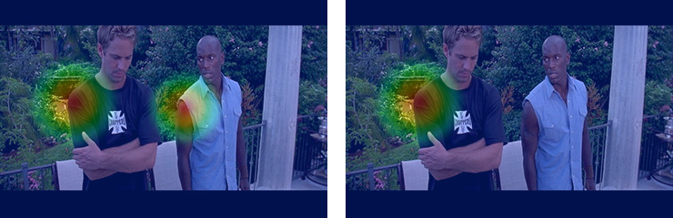

4. 

### CPM

整体模型架构

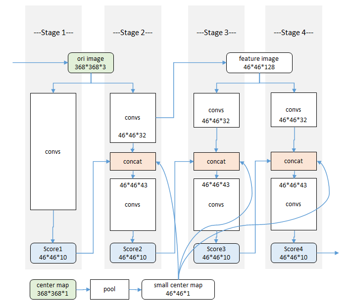

- 使用多个stage逐步优化关键点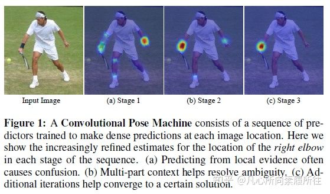

+ 使用局部图像信息定位关键点

  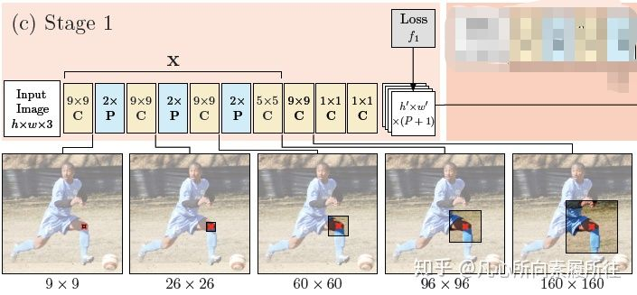

+ 带有空间上下文信息的级联预测

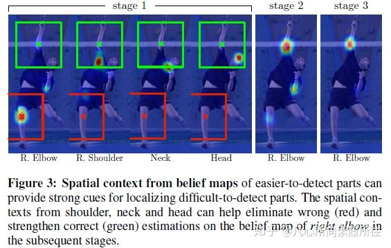

+ 增大感受野

  大的感受野可以通过池化操作得到（但要牺牲精度），也可以通过增大卷积核的尺寸来实现（会增加参数数量），也可以通过增加卷积层层数实现（训练的时候可能会遇到梯度消失的风险）

  各阶段感受野如下：

  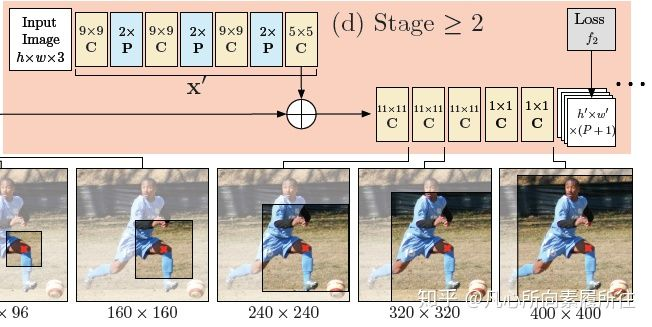

+ 中继监督减小梯度消失

  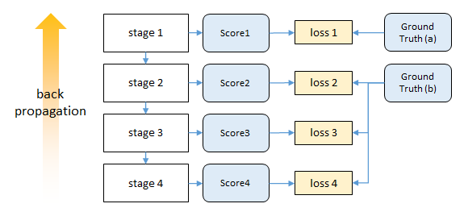

## CPN--级联金字塔网络

## Simple Baseline

## MSPF

## HRNet之姿态估计

> 论文
>
> 《Deep High-Resolution Representation Learning for Human Pose Estimation》
>
> 《HRNetV2：High-Resolution Representations for Labeling Pixels and Regions》
>
> 博客：
>
> [HRNet](https://zhuanlan.zhihu.com/p/66848624)
>
> [HrNet V2总结](https://ai-chen.github.io/%E8%AF%AD%E4%B9%89%E5%88%86%E5%89%B2%E8%AE%BA%E6%96%87%E9%98%85%E8%AF%BB/2019/06/20/HrNet-V2.html)
>
> [【论文阅读笔记】HRNet--从代码来看论文](<https://blog.csdn.net/weixin_38715903/article/details/101629781>)
>
> [（原）人体姿态识别HRNet](https://www.cnblogs.com/darkknightzh/p/12150637.html)

生成可靠的高分辨率表示

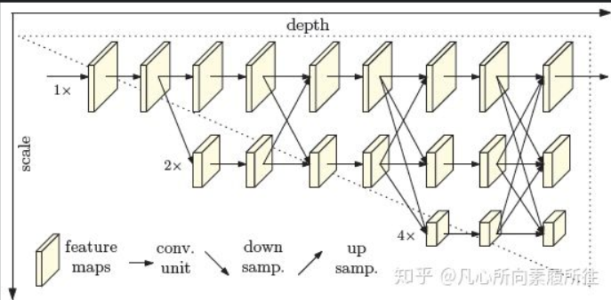

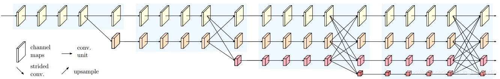

### 相关研究

1. High-to-low and low-to-high

Hourglass，CPN，SimpleBaseline，Combination with dilated conv

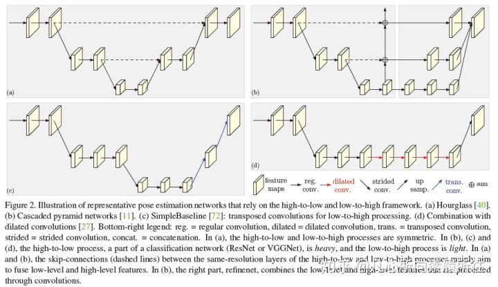

2. Multi-scale fusion

3. Intermediate supervision

HRNet不需要中继监督

### HRNet模型

1. ### Sequential multi-resolution subnetworks

   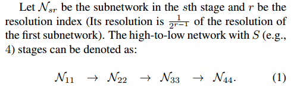

2. ### Parallel multi-resolution subnetworks

   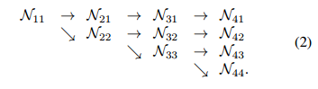

3. ### Repeated multi-scale fusion

   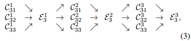

   交换单元：

   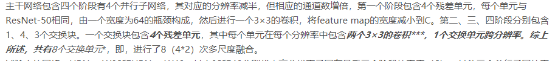

   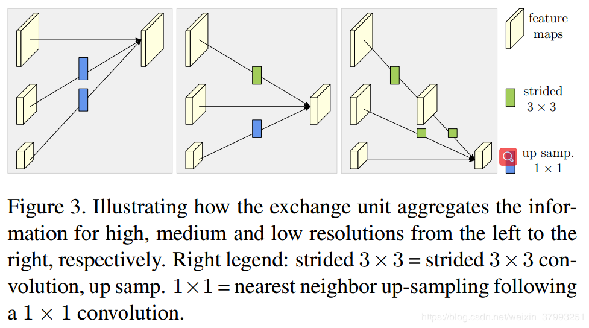

   信息交换：

   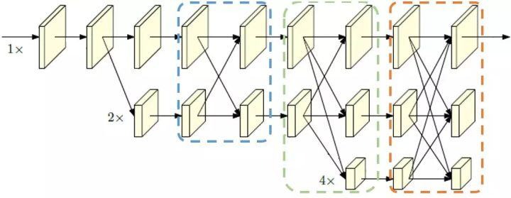

   蓝色框内为阶段内的多分辨率表征信息交换（Int. exchange within），绿色框为阶段间的多分辨率表征信息交换（Int. exchange across），红色框为最终的多分辨率表征信息交换（Final exchange）

   三种信息交换对比：

   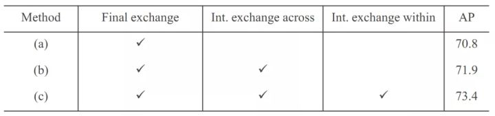

### HRNetV2

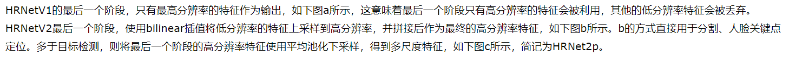

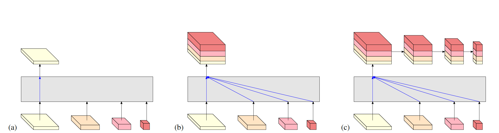

## DeepPose

## IntegralPose

##  AlphaPose

## 

## 常见模型算法

### openpose

### deeppose

### 

