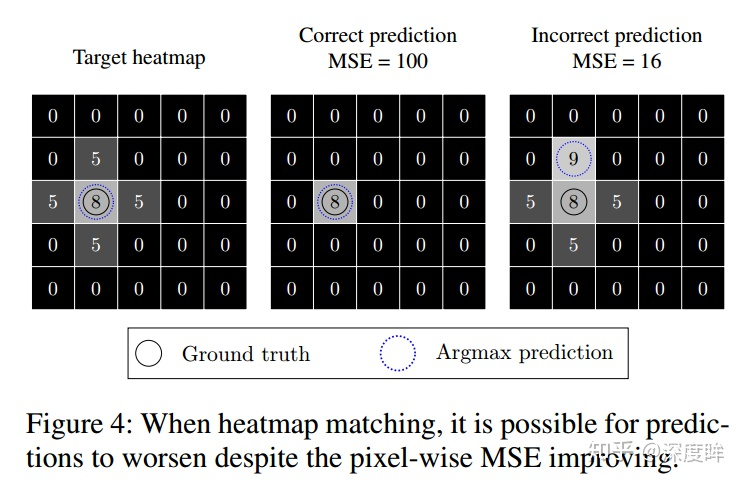
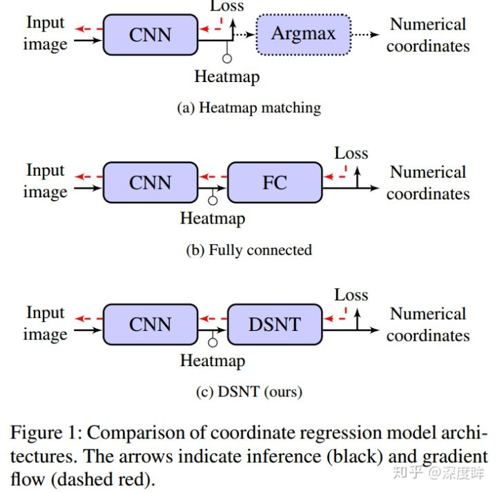

# 关键点之热力图与坐标回归

---

> [Numerical Coordinate Regression=高斯热图 VS 坐标回归](<https://zhuanlan.zhihu.com/p/53057942>)
>
> [关键点检测中，为什么要生成高斯图，而不是直接与ground_truth比较？](https://www.zhihu.com/question/293815527?sort=created)

## 方案一：全连接直接回归坐标

+ 优点：训练和前向速度可以做到很快，端到端全微分训练

+ 缺点：缺乏空间泛化能力

空间泛化是指模型训练期间在一个位置获得的知识在推理阶段推广到另一个位置的能力

如果采用全连接输出坐标点方式是会极大损害空间泛化能力的，其实从理论上也很容易分析出来：在训练阶段有一个球一直在图片左上角，reshape拉成一维向量后，全连接层的激活权重全部在上半部分，而下半部分的权重是没有得到训练的，当你测试时候输入一张球放在了右下角图片，拉成一维向量后，由于下半部分权重失效，理论上是预测不出来的，即没有空间泛化能力。而卷积操作由于权重共享，是可以有效避免的

> regression模型很容易训练，甚至即是很少的数据也能够训练。当然与此带来的就是极度的容易过拟合和泛化问题（如果说数据能够觉得那当我没说）。key points之间的能够保持某种潜在的“秩序”（比如face alignment中双眼+鼻子+两嘴角构成的5个点，这5个点总是会保持方位上的秩序）。这种秩序性更体现在，如果输入是一张完全不相关的图像，regression依然可以给出一个形状上非常合理的结果（反观heatmap所给的key points则会完全乱了套）。所以，我一直不明白regression类方法的本质是什么？

总结一下：**全连接方式所得权重严重依赖于训练数据的分布，非常容易造成过拟合**，这个现象我在做关键点项目预测时候发现确实很严重

## 方案二：高斯热图

+ 优点是精度通常高于方法(1)；
+ 缺点也很明显，从输入到坐标点输出不是一个全微分的模型，因为从heatmap到坐标点，是通过argmax方式离线得到的(其实既然argmax不可导，那就用soft argmax代替嘛，有论文确实是这么做的)。
+ 并且由于其要求的输出特征图很大，训练和前向速度很慢，且内存消耗大

优点解释二：

那么构造heatmap实际上是构造了一个中间状态，这个heatmap有如下的一些优点：

1. 可以让网络全卷积，因为输出就是2维图像，不需要全连接。
2. 关节点之间（头和胸口，脖子和左右肩膀）是有很强的相关关系的。然而单独的对每一类关节点回归坐标值并不能捕捉利用这些相关关系，相反当回归heatmap时，一张输入图像对应的heatmap就存在这种相关关系，那就可以用来指导网络进行学习。简言之，头关节的回归可以帮助胸口关节，脖子关节的回归也可以帮助左右肩膀，反之亦然。
3. heatmap同样捕捉了前景（关节点）与背景的对比关系，同样可以用来指导网络进行学习。这样，通过这条途径获得一个比较好的predictedHeatmap（易于学习，效果很好），再通过其他方法获得最终的关节点位置坐标，就是目前single person pose estimation的基本pipeline。

方式（1）相比于方式（2）是一种更难学习的监督方式，网络需要自行将空间位置转换为坐标。

方式（2）中网络的任务很直观，把和目标相似的位置输出高激活值就OK，这其实可以理解成在做滤波，也就是卷积干的事情

### 为何要附上高斯图

很多任务中，目标点其实很难准确的被某一个像素位置定义的，也就很难被准确的标注。目标点附近的点其实也很像目标点，我们直接将其标为负样本，可能给网络的训练带来干扰，将其用高斯函数做一个**“软标注**”，网络也就更好收敛。

加上高斯图，也能够给网络的训练增加一个方向性的引导，距离目标点越近，激活值越大，这样网络能有方向的去快速到达目标点

### 高斯图为啥精度更高

由于输出特征大，空间泛化能力强？

**如果我依然采用(1)直接回归坐标的方法预测，但是我不再采用全连接，而是全卷积的方式依然会出现精度低于高斯热图的现象，原因是即使全卷积输出，但是像yolo-v2、ssd等其输出特征图很小，导致空间泛化能力不如方法(2)**。

### 从误差看--误差下界

单从数值上来看，肯定是直接回归坐标点方式好啊，因为直接回归坐标点的话，输出是浮点数，不会丢失精度，而高斯热输出肯定是整数？？

高斯热图理论误差下界：

假设输入图片是512x512，输出是缩小4倍即128x128，那么假设一个关键点位置是507x507，那么缩小4倍后，即使没有任何误差的高斯热图还原，也会存在最大507-126*4=3个像素误差，这个3就是理论误差下界

### MSE loss导致的关键点不准

第一幅图是target热图，第二副和第三副图是假设预测出来的两种情况，正常情况下，第二副预测的更准，但是实际上如果采用mse loss,那么第三副图的loss比第二副小，这就出现问题了，会导致预测的关键点是不准确的。

### 总结

总结一下，虽然高斯热图预测的精度通常高于回归的方法，但是其存在几个非常麻烦的问题：(1) 输出图很大，导致内存占用多、推理和训练速度慢；(2) 存在理论误差下界；(3) mse loss可能会导致学习出来的结果出现偏移；(4) 不是全微分模型；

各种方法的梯度流

**方式(a)缺点是不是全微分，低分辨率输出情况下精度较低；(b)的缺点是丢失了空间泛化能力，非常容易过拟合，高分辨率情况下精度不行；而(c)具备了全部优点，个人觉得最大优点是可以在低分辨率情况下得到近似相同精度的结果**

