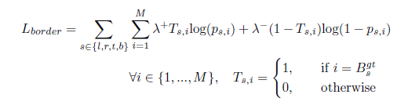
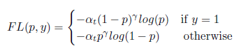

#  物体检测综述

---

> 参考资料：
>
> [github object detection](<https://github.com/hoya012/deep_learning_object_detection>)
>
> [物体检测算法全概述：从传统检测方法到深度神经网络框架](<https://mp.weixin.qq.com/s/bTcPRVg7sfxy2oUT3jDcbQ?utm_medium=hao.caibaojian.com&utm_source=hao.caibaojian.com>)
>
> [基于深度学习的目标检测算法综述（一）](<https://zhuanlan.zhihu.com/p/40047760>)
>
> [基于深度学习的目标检测算法综述（二）](<https://zhuanlan.zhihu.com/p/40020809>)
>
> [基于深度学习的目标检测算法综述（三）](<https://zhuanlan.zhihu.com/p/40102001>)
>
> [关于物体检测，你想要的，这里都有（一）](<https://zhuanlan.zhihu.com/p/39345914>)
>
> [关于物体检测，你想要的，这里都有（二）](<https://zhuanlan.zhihu.com/p/39369087>)
>
> [CVPR2019目标检测方法进展综述](<https://zhuanlan.zhihu.com/p/59398728>)
>
> [目标检测最新进展总结与展望](<https://zhuanlan.zhihu.com/p/46595846>)
>
> [干货 | 目标检测入门，看这篇就够了（上）](<https://cloud.tencent.com/developer/article/1109497>)
>
> [**DeepLearning-500-questions**](https://github.com/scutan90/DeepLearning-500-questions/blob/master/ch08_%E7%9B%AE%E6%A0%87%E6%A3%80%E6%B5%8B/%E7%AC%AC%E5%85%AB%E7%AB%A0_%E7%9B%AE%E6%A0%87%E6%A3%80%E6%B5%8B.md)
>
> 
>
> 参考论文：
>
> 《Recent Advances in Object Detection in the Age of Deep Convolutional Neural Networks》
>
> 《Deep Learning for Generic Object Detection: A Survey》

---

[TOC]

## 概述

### 检测算法的发展

目标检测发展里程碑

### 传统方法

物体检测一向是比较热门的研究方向，它经历了传统的人工设计特征+浅层分类器的框架，到基于大数据和深度神经网络的End-To-End的物体检测框架的发展

检测算法里面通常包含三个部分，第一个是检测窗口的选择， 第二个是特征的设计，第三个是分类器的设计。

在传统的检测算法领域，2001年一篇基于Haar+Adaboost的检测方法第一次实现了实时的检测。传统算法主要包括以下三个要点：

+ 检测窗口的选择：
  + 暴力搜索候选框+金字塔多尺度搜索，效率太低
  + 利用先验知识（如肤色）去除部分候选区域，有可能误判
  + 进一步衍生selective search或edgebox等方法，基于颜色聚类、边缘聚类去除区域
+ 特征的设计：
  + Haar：提取速度快，能够表达物体多种边缘变化信息，并且可以利用积分图快速计算
  + LBP：更多的表达物体的纹理信息，对均匀变化的光照有很好的地适应性
  + HOG：通过对物体边缘使用直方图统计来进行编码，特征表达能力更强
+ 分类器的设计
  + Adaboost：通过Adaboost自适应地挑选分类精度高的弱分类器并将它们加权起来，从而提升检测性能
  + SVM分类器：通过最大化分类间隔得到分类平面的支持向量，在线性可分的小数据集上有不错的分类精度，另外通过引入核函数将低维映射到高维，从而线性可分
  + Decision Tree：通过学习每个节点的分类器来构造决策树，最终形成一个强分类器
  + Random Forest：通过对决策树进行Ensemble，组合成随机森林更好的提高分类或者回归精度。

机器学习方法为目标检测领域带来了巨大的变革。检测领域中最受欢迎的一种机器学习算法包括boosting、SVM等。

第一波基于机器学习的检测方法都基于人工视觉特征，并由分类器或回归器进行处理，包括Haar、edgelets、shapelets、HOG、Bag-of-Words、积分直方图、颜色直方图、协方差描述子、LBP或者是他们的结合。在深度卷积神经网络的变革之前，应用最多的模型是Deformable Part Model以及他的变体。

### 深度学习方法

检测算法的发展分为两个阶段：一个是基于传统特征的解决方案；一个是基于深度学习的方法。

最早将卷积网络用于检测和定位中的是九十年代。第一个基于深度卷积神经网络的目标检测方法利用滑动窗口的方法，在可能的图像位置或者特殊的感兴趣位置使用微调的分类器。

进入深度学习时代以来，物体检测发展主要集中在两个方向：two stage算法如R-CNN系列和one stage算法如YOLO、SSD等。

两者的主要区别在于：

+ two stage算法需要先生成proposal（一个有可能包含待检物体的预选框），然后进行细粒度的物体检测。
+ one stage算法会直接在网络中提取特征来预测物体分类和位置。

- 

### 难点

## 经典模型框架

基本的Backbone网络与检测模型的精度息息相关，当Backbone网络的分类效果提升时，类似Faster-RCNN、R-FCN、SSD等算法的效果也会有所改善。

为了解决Backbone应用中的多尺度问题，使用了以下策略

- 多尺度检测器（Multi-scale detections）：
- 层融合（Fusion of layers）

发展脉络：（红色为经典的算法模型）

### Two Stage方法

#### 1. R-CNN

Pipeline:

+ 通过 [Selective Search](<https://blog.csdn.net/guoyunfei20/article/details/78723646>)方法获取候选区域
+ 将候选区域裁剪缩放到相同尺寸
+ 利用CNN提取的固定长度特征，训练一系列特定类别的线性SVM分类器
+ 对每个提取了CNN特征的目标类别进行边框回归

缺点：

+ 训练是一个多阶段的复杂过程
+ 大量粗略定位的候选区域需要额外的检测
+ 由于CNN特征分别从分别从每张图片的每一个候选区域提取，训练SVM分类器的磁盘空间、时间成本太高
+ 同理，测试时间也较慢

#### 2. SPPNet

为了解决R-CNN效率低的问题，提出[空间金字塔池化](SPP-Net论文详解)的方法。

实际应用中，在CNN最后一个卷积层之前加上SPP层，使FC层的输入尺寸相同。SPPNet是将整张图一次性输入，一次即可提取特征，并找到feature map对应的候选区域，通过SPPnet提取固定长度的特征。速度得到大大的提高。最后一步和RCNN一样使用SVM算法进行特征向量分类识别

#### 3. Fast R-CNN

Fast R-CNN 实现了端到端的检测训练（忽略候选区域的形成过程），使用softmax分类器和特定类别的边框回归的多任务损失，而不是在不同的阶段训练不同的分类回归器。（回归损失函数和RCNN一致）

Fast RCNN在不同的候选区域之间共享计算，并在最后一个卷积层之后加上RoI pooling层，是每个候选区域能够提取固定长度的特征。

> 什么是ROI pooling？
>
> - 将region proposal划分为H×W大小的网格
> - 对每一个网格做MaxPooling（即每一个网格对应一个输出值）
> - 将所有输出值组合起来便形成固定大小为H×W的feature map

#### 4. Faster R-CNN!!

Fast R-CNN 加速了检测过程，但仍然依赖于外部的区域候选过程，region proposal成为了新的瓶颈。Faster R-CNN最主要的创新点在于将候选区域的提取在特征图上进行。

[Faster R-CNN](<https://zhuanlan.zhihu.com/p/31426458>) 提出了RPN网络，用于提取候选区域，Fast R-CNN用于区域分类。

RPN中的anchors实际就是一组生成的矩形

RPN网络：

+ 上面一条通过softmax分类anchors获得foreground和background（检测目标是foreground）
+ 下面一条用于计算对于anchors的bounding box regression偏移量，以获得精确的proposal。
+ 而最后的Proposal层则负责综合foreground anchors和bounding box regression偏移量获取proposals，同时剔除太小和超出边界的proposals。其实整个网络到了Proposal Layer这里，就完成了相当于目标定位的功能。

#### 5. FPN

特征金字塔网络 Feature Pyramid Networks(FPN)。FPN 主要解决的是物体检测中的多尺度问题，通过简单的网络连接改变，在基本不增加原有模型计算量情况下，大幅度提升了小物体检测的性能。

当小物体的尺寸小于stride大小时，小物体的检测性能会急剧下降。

传统解决该问题的思路包括:

+ 多尺度训练和测试：即图像金字塔
+ 特征分层：每层预测对应的scale分辨率结果

四种不同的生成多维度特征组合的方法：

+ （a）中，是将图像做成金字塔，分别跑一个NN来做，这样计算量极大。
+ （b）中是目前Faster RCNN等采用的方法，只在single scale上做。
+ （c）中是直接将各个layer输出的层级feature map自然地看做feature pyramid
+ （d）不同层级的feature map做了merge，能够使得每个level的语义信息都比较强

对于（d）中的FPN：

+ 自下至上的通路：浓缩提取特征
+ 自上至下的通路：在处理每一层信息时会参考上一层的high level信息做为其输入（这里只是在将上层feature map等比例放大后再与本层的feature maps做element wise相加）
+ CNN层特征与每一级别输出之间的表达关联：作者实验表明使用1x1的Conv即可生成较好的输出特征，它可有效地降低中间层次的channels 数目。最终这些1x1的Convs使得我们输出不同维度的各个feature maps有着相同的channels数目

FPN+Fast RCNN：

+ FPN产生特征金字塔，即多个feature map，金字塔通过RPN之后产生很多候选区域；
+ 大尺度的ROI要从低分辨率的feature map上切，有利于检测大目标，小尺度的ROI要从高分辨率的feature map上切，有利于检测小目标。

#### 6. R-FCN

[Region-based FCN](<https://zhuanlan.zhihu.com/p/30867916>)：基于区域的全卷积网络

+ R-FCN 改变了 ROI Pooling的使用方法，称为 Position-Sensitive ROI Pooling，位置敏感的ROI池化，简称PS ROI Pooling，这是为了增加平移可变性而引入的结构；提出基于Position-sensitive score maps来解决目标检测的位置敏感性问题
+ 只有共享卷积子网路，深度比Faster-RCNN深
+ 和Faster R-CNN相比，R-FCN具有更快的运行速度（2.5倍以上），稍微提高了一点检测精度，在速度和准确率之间进行了折中

#### 7. Mask RCNN

[Mask RCNN](<https://zhuanlan.zhihu.com/p/37998710>) 沿用了Faster RCNN的思想，特征提取采用ResNet-FPN的架构，另外多加了一个Mask预测分支。

Mask-RCNN = ResNet-FPN+Fast RCNN+mask

Mask-RCNN 相对来说结构较为简单，只是在ROI pooling（ROI Align）之后添加了卷积层，进行mask预测任务

ROI Align: Faster RCNN与原始图像是不对准的（？？），ROIAlign可以保持大致的空间位置

+ 假设ROI的bounding box为 $[x_1,y_1,x_2,y_2]=[0,3,7,8]$，
+ 将它划分为2x2的网格，因为ROI的长宽除以2是不能整除的，所以会出现每个格子大小不一样的情况。
+ 进行max pooling的最终2x2的输出

Mask-RCNN中加入mask loss

#### 

### One Stage 方法

#### 1. DetectNet

该模型将目标视为一个回归问题

+ 使用AlexNet作为基本模型，并且将最终的softmax分类器替换为一个回归器
+ 使用一个网络在一个粗略的网格上来预测前景像素，并使用四个网络来预测像素的上下左右四个部分
+ 对于每一种物体类型和Mask类型都需要训练一个网络

#### 2. OverFeat

OverFeat实际就是特征提取算子，将分类中提取到的特征又用于定位检测问题。

+ 利用滑动窗口和规则块生成候选框，再利用多尺度滑动窗口增加检测结果，解决目标复杂、尺寸不一的问题。在最后一个pooling层做滑动窗口，增加速度
+ 在分类问题上训练出模型后，固定卷积层，对定位模型进行finetuning，1k个类别做了1k个finetuning

#### 3. YOLO v1

[YOLO](<https://blog.csdn.net/m0_37192554/article/details/81092514>)核心思想：利用整张图作为网络的输入，直接在输出层回归bbx位置及类别

算法步骤：

1. `网格划分`：：算法首先把输入图像划分成S*S的格子，然后对每个格子都预测B个bounding boxes，每个bounding box都包含5个预测值：x,y,w,h和confidence
2. `寻找目标中心`：：如果一个object的ground truth的中心点坐标在一个grid cell中，那么这个grid cell就是包含这个object，也就是说这个object的预测就由该grid cell负责
3. `计算confidence Score`：：每个bounding box都对应一个confidence score，如果grid cell里面没有object，confidence就是0，如果有，则confidence score等于预测的box和ground truth的IOU值
4. `排序&去重`：：在某个类别中（即矩阵的某一行），将得分少于阈值（0.2）的设置为0，然后再按得分从高到低排序。最后再用NMS算法去掉重复率较大的bounding box
5. `取最大class score`：：最后每个bounding box的20个分类score取最大的score，如果这个score大于0，那么这个bounding box就是这个socre对应的类别（矩阵的行），如果小于0，说明这个bounding box里面没有物体

> `非极大值抑制NMS`: 针对某一类别，选择得分最大的bounding box，然后计算它和其它bounding box的IOU值，如果IOU大于0.5，说明重复率较大，该得分设为0，如果不大于0.5，则不改；这样一轮后，再选择剩下的score里面最大的那个bounding box，然后计算该bounding box和其它bounding box的IOU，重复以上过程直到最后

#### 4. YOLO v2

YOLO有两个缺点：
1. 一个缺点在于定位不准确，对相互靠的很近的物体，还有很小的群体检测效果不好，这是因为一个网格中只预测了两个框，并且只属于一类
2. 另一个缺点在于和基于region proposal的方法相比召回率较低。

改进：

#### 5. YOLO v3

改进之处：

+ 多尺度预测
+ 更好的基础网络和分类器Darknet-53

不用softmax做分类了，而是使用独立的logisitc做二分类。这种方法的好处是可以处理重叠的多标签问题，如Open Image Dataset。在其中，会出现诸如Woman和Person这样的重叠标签

#### 6. SSD

[Single Shot MultiBox Detector](<https://blog.csdn.net/xiaohu2022/article/details/79833786>)

one-stage方法，如Yolo和SSD，其主要思路是均匀地在图片的不同位置进行密集抽样，抽样时可以采用不同尺度和长宽比，然后利用CNN提取特征后直接进行分类与回归，整个过程只需要一步，所以其优势是速度快，但是均匀的密集采样的一个重要缺点是训练比较困难，这主要是因为正样本与负样本（背景）极其不均衡（参见Focal Loss），导致模型准确度稍低。

+ SSD直接采用了卷积来做检测，YOLO是在卷积之后加上全连接层来做检测
+ SSD提取了不同尺度的特征图来做检测，大尺度特征图（较靠前的特征图）可以用来检测小物体，而小尺度特征图（较靠后的特征图）用来检测大物体
+ SSD采用了不同尺度和长宽比的先验框（Prior boxes, Default boxes，在Faster R-CNN中叫做锚
+ Yolo算法缺点是难以检测小目标，而且定位不准，但是这几点重要改进使得SSD在一定程度上克服这些缺点

#### 7. RetinaNet

[RetinaNet](<https://blog.csdn.net/JNingWei/article/details/80038594>) 就是一个FPN-based的one-stage detector，靠着最后面的focal loss来解决由于过量background而引起的类别不平衡

one-stage detector的accuracy不高的问题根源在于“类别不平衡”。RetinaNet采用Focal loss 来解决类别不平衡问题。

+ 什么是类别不平衡？

检测算法在早期会生成一大波的bbox。而一幅常规的图片中，顶多就那么几个object。这意味着，绝大多数的bbox属于background

正是因为bbox中属于background的bbox太多了，所以如果分类器无脑地把所有bbox统一归类为background，accuracy也可以刷得很高。于是乎，分类器的训练就失败了。分类器训练失败，检测精度自然就低了。

对于two stage算法，第一个stage的RPN会对anchor进行简单的二分类（只是简单地区分是前景还是背景，并不区别究竟属于哪个细类）。经过该轮初筛，属于background的bbox被大幅砍削。虽然其数量依然远大于前景类bbox，但是至少数量差距已经不像最初生成的anchor那样夸张了。就等于是 从 “类别 极 不平衡” 变成了 “类别 较 不平衡” 。

+ 为什么Focal loss可以解决类别不平衡问题?

## 训练与测试

### 数据集

- [PASCAL VOC](http://host.robots.ox.ac.uk/pascal/VOC/)

- [COCO](http://cocodataset.org)：迄今最具有挑战的目标检测数据集,[COCO排行榜](http://cocodataset.org/#detection-leaderboard)

- [ImageNet](http://image-net.org)：

- [VisualGenome](https://visualgenome.org)

- [OpenImages](https://storage.googleapis.com/openimages/web/index.html)

- Face detection数据集：

  

- Logo Detection：

  

### 评价指标

[目标检测中的评价指标](<https://blog.csdn.net/u014061630/article/details/82316849>)

- 平均准确率AP：在Pascal VOC比赛中，每个类别使用一个单独的AP得分进行评价
- 由于检测方法的多样性，ROC和DET评价指标并不适用，因为他们假设所有的方法使用相同的窗口提取策略
- 对于给定类别，PR曲线由待评测方法排序结果计算得到；AP简要说明了PR曲线的结果
- 平均精度mAP: 0.5-0.95之间10种不同的IOU阈值得到的AP值的平均

通过改变 confidence 阈值，我们能够改变预测的 box 是否是正确的。基本上，高于阈值的所有预测（box + class）被认为是 positive boxes，低于阈值则为 negatives。

现在，我们计算 Ground Truth 和 模型预测的 Positive detection 的 IoU。基于设定的 IoU 阈值（这里我们暂且设置IoU阈值为0.5），我们为每一张图像的各类目标计算正确检测的数量(TP)。

### 损失函数

>  参考论文1

与分类相比，目标检测问题需要考虑利用边框回归获得精确定位，以及目标前景区域与背景区域的不平衡问题。多元交叉熵损失、对数损失等是分类以及区域检测中常用的损失，例如：

+ 二元交叉熵损失：常用来学习混合目标
+ 多元对数损失：用于分类
+ Fast-RCNN使用多任务损失：$L_{reg}$是smooth $L_1$ loss

#### 边框回归损失

由于精确定位是主要任务，许多论文提出了更加复杂的定位损失。

1. 二元对数回归损失：in-out loss

   + 将图像分为M行M列

   + 计算每行每列位于预测框之内或之外的概率

     

2. 另外，还会计算每行每列是否是预测框的准确边界

   

3. 直接改进IOU

   

#### 不平衡类别损失

针对Anchor类别不平衡问题，一种解决方案是采用OHEM方法：只选择Hard examples来计算梯度，可以在一定程度上解决该问题

另外，可以对交叉熵损失进行微调，得到focal loss，该损失考虑了所有的anchor，对easy example惩罚小，对hard example惩罚较大

还可以采用其他较为简单的策略，如重新调整交叉熵，是少数类拥有更大的权重

#### 其他损失

Kaiming He指出在Faster-RCNN添加一个子网络，并使用分割损失，能够提高检测性能。

Li引用position-sensitive inside/outside score maps来同时训练检测和 分割网络

王提出一种预测边框之间的排斥损失，以便对于一个ground truth得到一个最终的预测

### 超参数

检测问题是一个高维度上的高度非凸问题。在目标检测的众多研究中，大都使用SGD或者ADAM优化方法。最重要的超参数就只剩下学习率和batch size

#### 学习率

在训练的过程中，没有一个具体的方法来确定学习率的大小，它取决于大量的因素：优化器、训练数据量、模型、batchsize等等，这些因素都是不可量化的。适用于某一环境的学习率可能不适用于另一个环境。

较大的学习率可能永不收敛，但是较小的学习率可能会得到欠佳的结果

Goyal提出 Linear Gradual Warmup strategy，即在初始阶段每次迭代逐渐增大学习率，到某一阈值后又开始逐渐减小。

#### Batch size

目标检测的研究通常并不关注较大或较小的batch size对训练过程带来的影响。由于GPU的内存限制，有时不得不采用较小的batch size

增大batch size的一个明显优点是能够缩短训练时间，但由于内存限制约束图像数量，因此需要使用更多的GPU。使用较大的batch size可能带来性能和速度的较大提升。

### 预训练

使用有相关性的数据集进行预训练，优于随机初始化

减小尺度方差：在低分辨率分类数据集预训练，或者目标实例的尺度范围，在图像金字塔中训练。减小尺度方差比使用尺度不变检测子检测的效果更好。问题是有的图像过小，放大后占用内存或无法用来训练，使用金字塔也会增加计算复杂度。

### 数据增强

通常使用的数据增强手段包括但不限于：scale, resize, translation, rotation, vertical and horizontal flipping, elastic distortions, random cropping and contrast, color, hue, brightness, saturation and sharpness adjustments etc.

最近使用的两种方法：Cutout和Sample Pairing。Taylor and Nitschke 发现 cropping是影响最大的方法

没有先验知识，很难知道哪种方法能够提高效果。

### NMS-Interenfence

> [各种改进的NMS](<https://www.itcodemonkey.com/article/10850.html>)：原始NMS，soft-NMS，softer-NMS，IoU-guided NMS（IoU-Net），其他

two stage 算法以及部分one stage算法都需要对Region Proposal去重

以猫狗检测为例，对于每一个选出来的BBX检测框，用（x,y,h,w, confidence score，Pdog,Pcat）表示：

+ confidence score表示background或者foreground的置信度得分，范围[0,1]
+ Pdog,Pcat分布代表类别是狗和猫的类别概率

Greedy NMS：有最高分数的预测框

+ 先选中得分最高的窗口
+ 遍历其他窗口，与选中窗口IOU若超过阈值则删除
+ 然后对剩下的窗口作同样的处理，直到所有的窗口进行了处理

通常稀疏目标数据需要设置较低的阈值；而拥有密集目标的数据设置较高的阈值为宜。

许多预测框聚类的方法被提出，mean shift聚类、凝聚聚类、仿射传播聚类、启发式变异等等方法。

一些论文使用卷积网络来学习NMS。另外有人对Greedy NMS做出改进，将临近检测得分不在完全设为0（删除），而是减小检测得分。

一些常见Tricks：

+ 在一个图像金字塔中进行多尺度的interfere
+ 在原始图像和水平翻转（或其他方向）进行NMS-interference；
+ 利用每个框的得分作为其权重进行边框投票
+ 使用复杂的基本网络？？？
+ 集成不同模型的预测结果

## 物体检测的发展

### New Idea

+ 图网络
+ 对抗训练
+ 使用情境信息

### Main Chanllenges

1. 尺度方差scale variance

   三个主要解决方案：

   + 建造图像金字塔，计算量增大；优化后方法[SNIP](<https://blog.csdn.net/u014380165/article/details/80793334>)（图像金字塔的尺度归一化）
   + 使用一系列不同纵横比的覆盖图像的默认参考框，可能导致不平衡问题
   + 使用多个卷积层来进行边框预测
   + 使用空洞卷积增加滤波器的步长，增大感受野大小

2. 旋转方差Rotational variance

   CNN现在没有处理数据旋转方差的能力

   + 数据增强：旋转
   + 使用带方向的边框+rotated pooling
   + 更复杂的使用四边形anchor，返回紧凑的区域
   + 使用度量学习方法

3. 领域自适应

   将在领域A训练的检测子在领域B使用

   大量生成人工图像，来合成数据；利用GAN来增加图片的真实性

4. 目标定位

   精确定位仍是两个最大的误差来源之一。预测框要求与真实框的IOU>0.95

   + 通常，定位通过L1/L2 loss + 分类损失来进行解决
   + 可以通过优化特征提取来提高定位精度，例如使用多层特征
   + 可以通过优化候选区域提取方法来提高定位精度
   + 通过优化NMS算法，来提高定位精度
   + 改善损失函数来提高精度

   

5. 遮挡
   + 使用遮挡的图片进行训练当然可行，但经常缺少数据，生成数据？
   + 增加固定几何结构的灵活性
   + 设计特定的回归损失
   + 改进NMS，使用soft-NMS降低重叠物体的得分
   + 使用线索已经环境信息帮助判断遮挡物体

6. 小目标检测
   + 图像尺寸放大（原始的放大效率低）
   + 使用浅层网络：当同时有多种尺度时，并不适用
   + 使用情境信息：
   + 超分辨率（使用GAN增加小目标的分辨率）

### 优化方向

