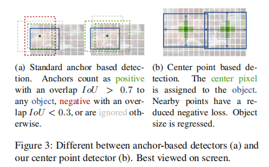
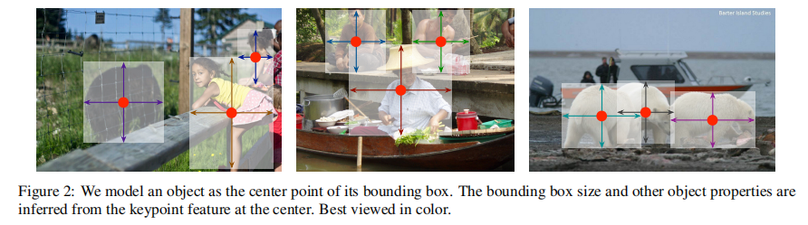
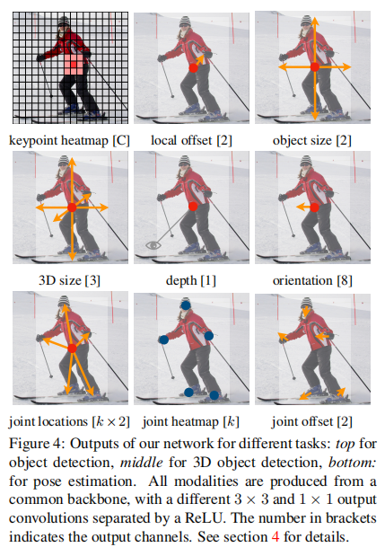
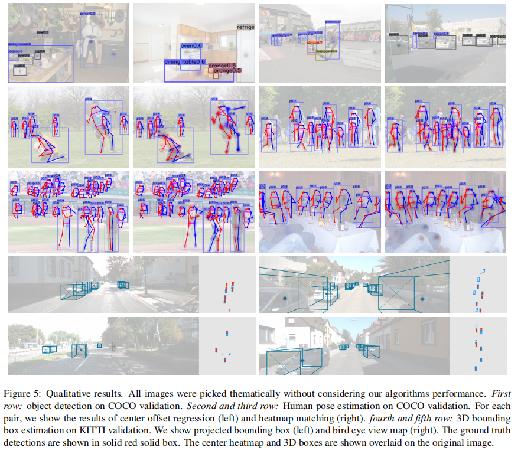
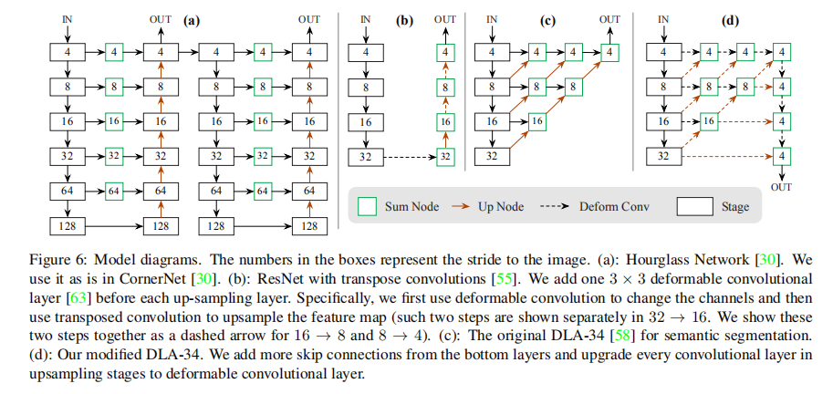

# CenterNet

---

> 参考论文：
>
> 《Objects as points》
>
> 参考博客：
>
> [扔掉anchor！真正的CenterNet——Objects as Points论文解读](<https://zhuanlan.zhihu.com/p/66048276>)

## Anchor Base与Anchor Free

anchor base与anchor free

## Object as Points

支持多种任务：

## 三种backbone模型结构

## centernet人体姿态估计

1. 中心点：利用heatmap热力图回归
2. 人体关节点：回归相对于中心点的偏置