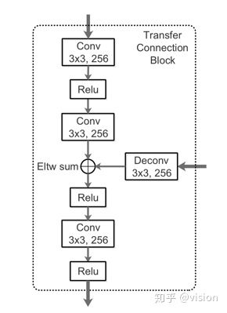
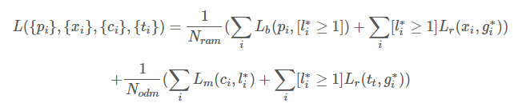

# RefineDet

---

> 参考资料：
>
> [RefineDet算法详解](<https://blog.csdn.net/woduitaodong2698/article/details/85258458#_60>)
>
> [聊聊目标检测中的多尺度检测（Multi-Scale），从 YOLO，ssd 到 FPN，SNIPER，SSD 填坑贴和极大极小目标识别](<http://bbs.cvmart.net/articles/125/liao-liao-mu-biao-jian-ce-zhong-de-duo-chi-du-jian-ce-multi-scale-cong-yolo-ssd-dao-fpn-sniper-ssd-tian-keng-tie-he-ji-da-ji-xiao-mu-biao-shi-bie>)
>
> [RefineDet(3)_总结_CVPR2018](<https://zhuanlan.zhihu.com/p/50858305>)
>
> [RefineDet (CVPR, 2018)](<https://hellozhaozheng.github.io/z_post/%E8%AE%A1%E7%AE%97%E6%9C%BA%E8%A7%86%E8%A7%89-RefineDet-CVPR2018/>)
>
> [RefineDet(5)_源码(1)_CVPR2018](<https://zhuanlan.zhihu.com/p/50917804>)
>
> [RefineDet 论文解析](<https://zhuanlan.zhihu.com/p/39184173>)
>
> [RefineDet-结合了单阶段和双阶段优点的目标检测器](<http://www.baiyifan.cn/2019/03/10/RefineDet/>)
>
> [Refinedet 论文笔记](<https://www.jianshu.com/p/5504f4188d52>)

---

## 简介

模型主要包含两大模块, 分别是anchor精化模块和物体检测模块. 网络采用了类似FPN的思想, 通过 Transfer Connection Block 将特征图谱在两个模块之间传送, 不仅提升了的精度, 同时还在速度方面取得了与one-stage方案相媲美的表现

传统two-stage方法的三个优势：

+ 使用启发式方法来处理类别不均衡问题
+ 使用两步级联来回归物体边框参数
+ 使用两阶段特征描述物体。更精细

当前的one-stage方法仅仅依赖于一次边框回归过程, 其主要是基于在不同尺度的特征图谱上来预测不同size的物体的位置, 因此预测的精度较低, 尤其是在面对小物体时. 

## 模型基本结构

RefineDet设计了两个内部连接的模块: anchor refinement module(ARM) 和 object detection module(ODM).

`ARM`：经典网络结构，去掉分类层，并加上一些附属结构

`ODM`：由TCBs和预测层（3*3 Conv）组成，输出score和相对refined anchor box 的相对位置

`TCB`：连接ODM与ARM，将不同层的特征转化为ODM接受的形式，使两者共享特征向量

### 两级级联回归

### Negative Anchor Filtering: 

本文设计了一个 negative anchor过滤机制. 具体来说, 就是在训练阶段, 对于一个refined anchor box, 如果它的负样本概率大于一个阈值(如0.99), 那么我们在训练 ODM 的时候就会忽略这个 refined anchor box, 具体代码实习时就是在匹配的时候, 将背景分类预测值大于 0.99 的直接置为 -1 即可

负样本筛选，本文的思路是`ARM`将负样本置信度大于门限值 θ 的目标框筛去，θ的经验值是`0.99`。也就是说ARM仅将正样本和困难的负样本送进`ODM`进行进一步检测

困难负样本挖掘采用了与`SSD`一致的方法，将负：正样本比例保持在`3:1`

###  TCB

TCB单元实质上就是top down结构，作用就是使得多尺度特征图的信道融合以此来丰富特征。

最后生成的特征图为：P3, P4, P5, P6（其中P3, P4, P5, P6的生成分别对应ARM中的conv4_3，conv5_3，fc7，conv6_2相对应。

> 有一个细节就是当conv4_3，conv5_3层在做anchor 的预测亦或者是做top down的TCB操作的时候为了防止反向传播的剃度过大导致loss输出nan，这两层会经过一个L2normlization操作然后分别扩大常量倍数，scale的值分别为10和3 

## 损失函数

二分类损失函数 LbLb 是二分类交叉熵损失, 多分类损失函数 LmLm 是 Softmax 多分类损失. LrLr 是 smooth L1 损失