# 视觉Transformer

---

>论文：
>
>《Attention Is All You Need》
>
>教程：
>
>[李宏毅-Transformer](https://www.bilibili.com/video/av56239558/)
>
>[3W字长文带你轻松入门视觉transformer](https://zhuanlan.zhihu.com/p/308301901)
>
>[详解Transformer （Attention Is All You Need）](https://zhuanlan.zhihu.com/p/48508221)
>
>[The Illustrated Transformer](http://jalammar.github.io/illustrated-transformer/)

## 简述

### 什么是seq2seq?

- sequence2sequence

其核心思想都是通过Encoder编码成一个表示向量，即上下文编码向量，然后交给Decoder来进行解码，翻译成目标语言

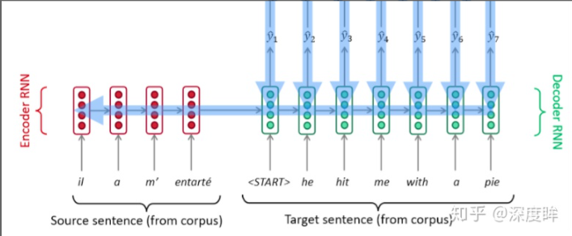


#### 基于attention的seq2seq

**将Query(通常是向量)和4个Key(和Q长度相同的向量)分别计算相似性，然后经过softmax得到q和4个key相似性的概率权重分布，然后对应权重乘以Value(和Q长度相同的向量)，最后相加即可得到包含注意力的attention值输出**

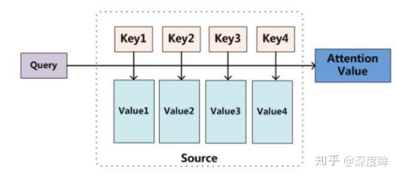

注意力机制代码

```python
# 假设q是(1,N,512),N就是最大标签化后的list长度，k是(1,M,512),M可以等于N，也可以不相等
# (1,N,512) x (1,512,M)-->(1,N,M)
attn = torch.matmul(q, k.transpose(2, 3))
# softmax转化为概率，输出(1,N,M)，表示q中每个n和每个m的相关性
attn=F.softmax(attn, dim=-1)
# (1,N,M) x (1,M,512)-->(1,N,512)，V和k的shape相同
output = torch.matmul(attn, v)
```

带有attention的seq2seq

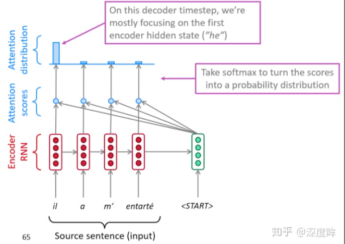

解码阶段会将第一个开启解码标志<START>(也就是Q)与编码器的每一个时间步的隐含状态(一系列Key和Value)进行点乘计算相似性得到每一时间步的相似性分数，然后通过softmax转化为概率分布，然后将概率分布和对应位置向量进行加权求和得到新的上下文向量，最后输入解码器中进行解码输出

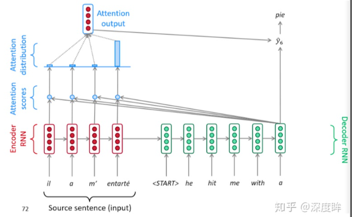

注意力机制优点

- 注意力显著提高了机器翻译性能
- 注意力允许解码器以不同程度的权重利用到编码器的所有信息，可以绕过瓶颈
- 通过检查注意力分布，可以看到解码器在关注什么，可解释性强

### 什么是self attention?

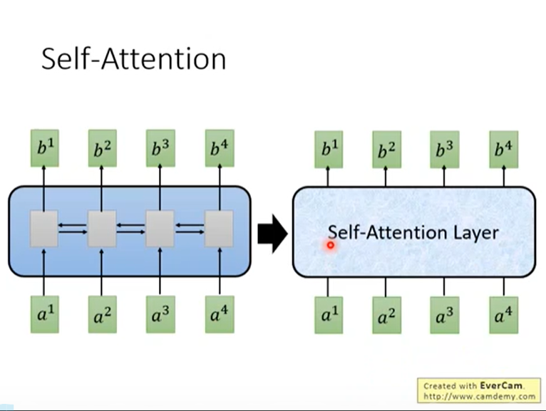

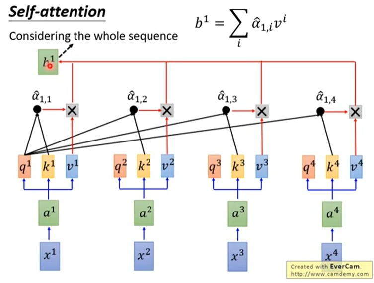

QKV的计算

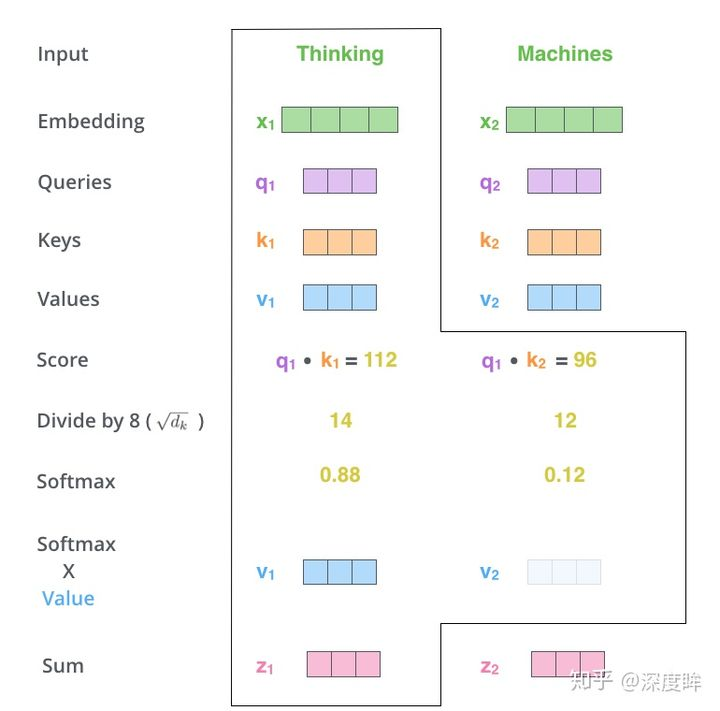

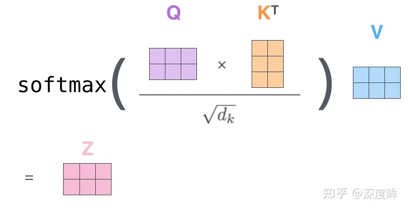

A->A^：softmax

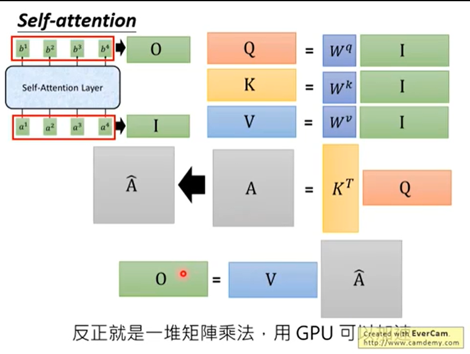

### Position encoding:

相当于添加一个 one hot 

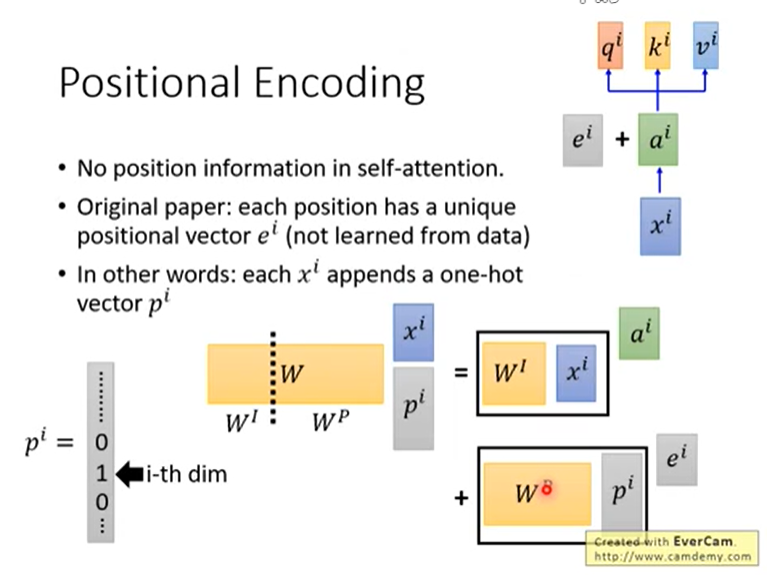

加入位置信息的方式非常多，最简单的可以是直接将绝对坐标0,1,2编码成512个长度向量即可

**在词向量中加入了单词的位置信息**


## Transformer

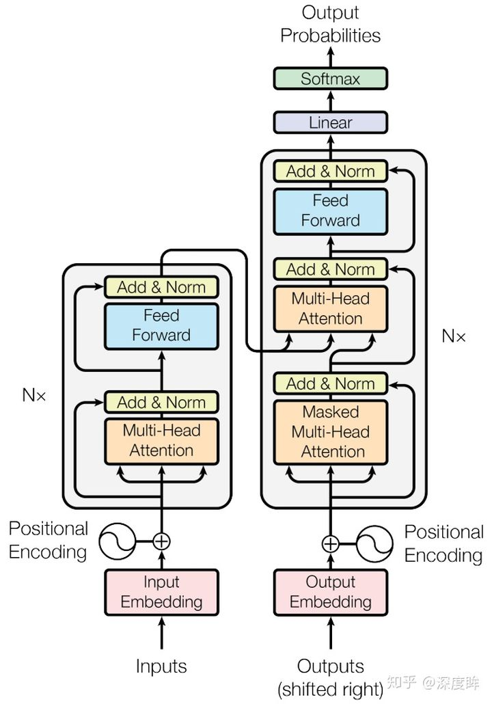

seq2seq with self attention

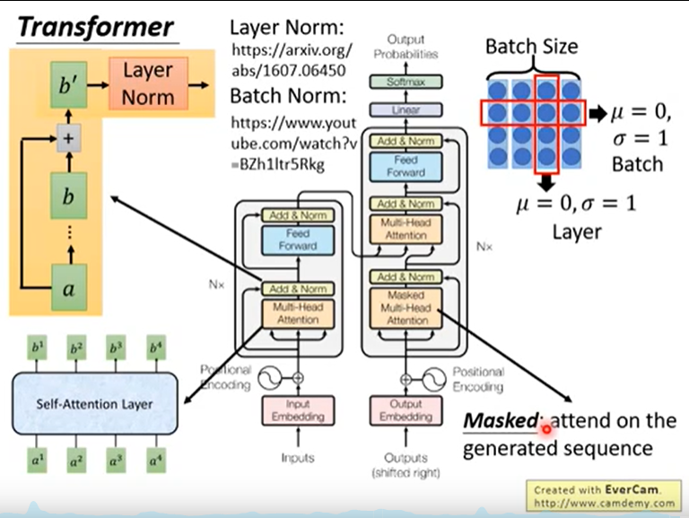


### Multi-Head Attention

简单来说就是类似于分组操作，将输入X分别输入到8个attention层中，得到8个Z矩阵输出，最后对结果concat即可

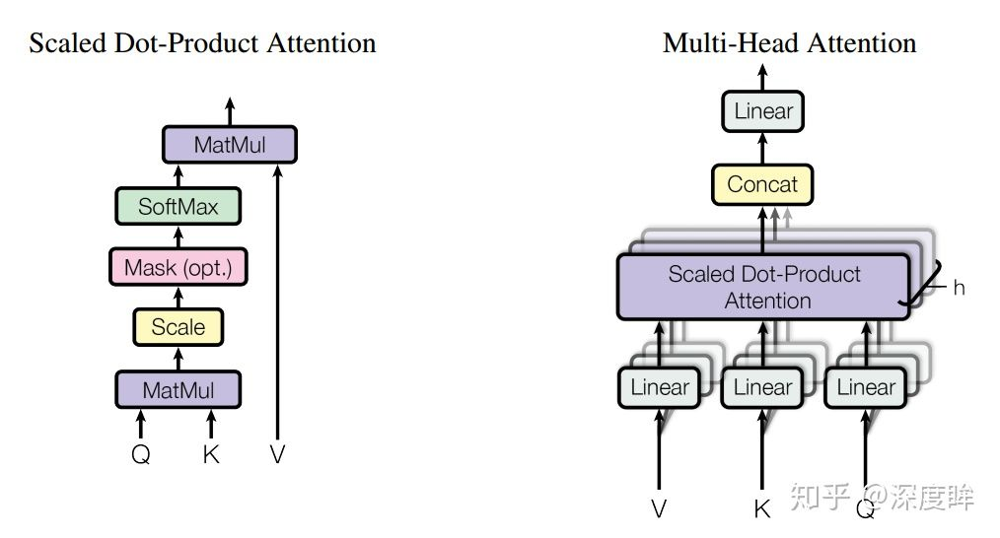

## 视觉Transformer-ViT


## Swin-Transformer


