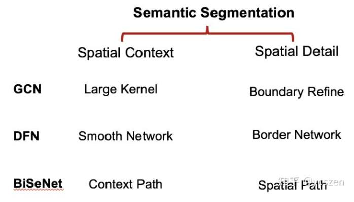
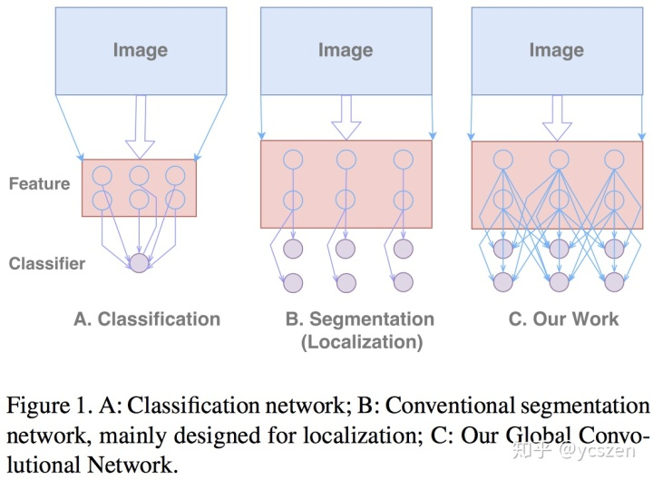
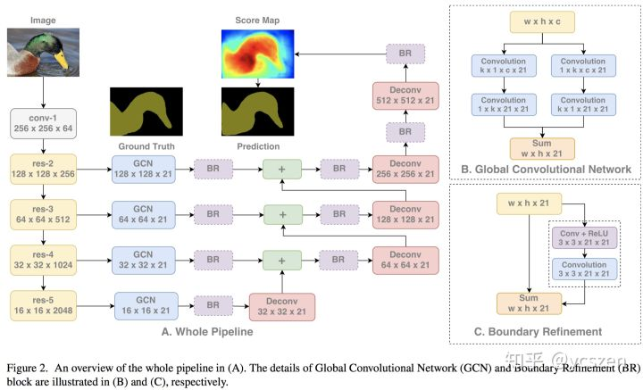
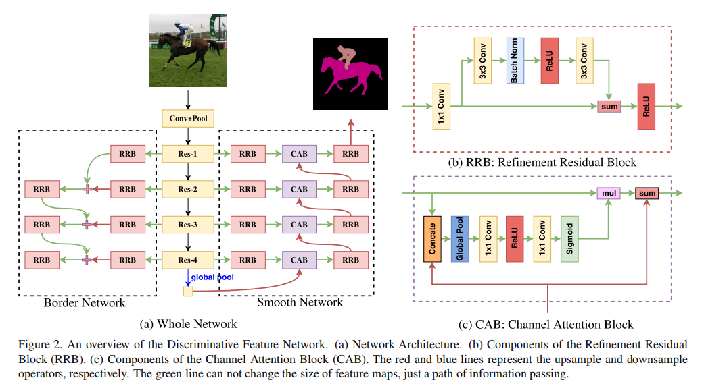
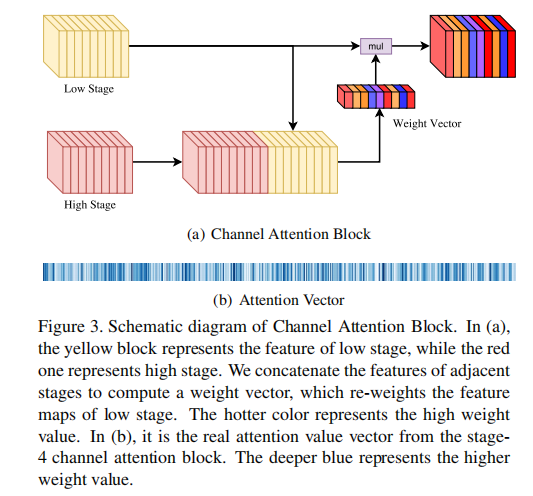
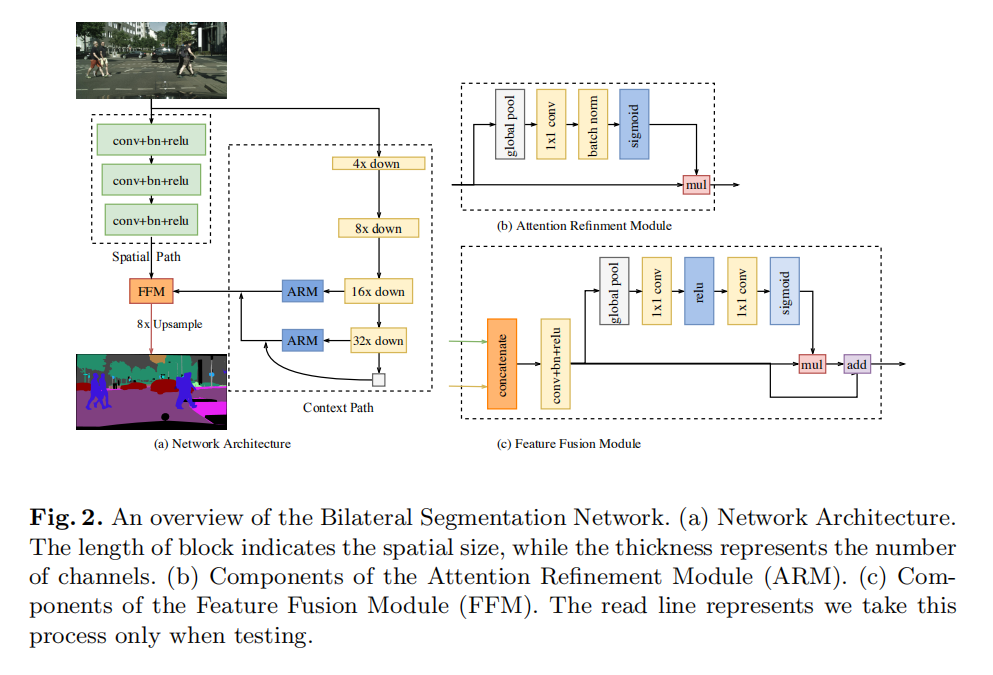

语义分割

---

> 参考博客：
>
> [超像素、语义分割、实例分割、全景分割 傻傻分不清？](<https://blog.csdn.net/electech6/article/details/85317608>)
>
> [从零开始学习的路线](<https://www.zhihu.com/question/322077321/answer/925208015>)
>
> [语义分割江湖的那些事儿——从旷视说起](<https://zhuanlan.zhihu.com/p/55263898>)

## 前言

### 概念

+ 超像素：超像素是一系列像素的集合，这些像素具有类似的颜色、纹理等特征，距离也比较近。

  

+ 语义分割：图像中每个像素赋予一个类别标签

+ 实例分割：它不需要对每个像素进行标记，它只需要找到感兴趣物体的边缘轮廓就行

+ 全景分割：语义分割和实例分割的结合。如下图所示，每个像素都被分为一类，如果一种类别里有多个实例，会用不同的颜色进行区分，我们可以知道哪个像素属于哪个类中的哪个实例。

### 发展脉络

两个最重要的设计：U-shape Structure 和 Dilation Conv

语义分割同时需要Spatial Context 和 Spatial Detail

Classification与localization的矛盾：

1. 从 Localization 来看，我们需要全卷积网络，而且不能有全连接或者全局池化等操作丢失位置信息。
2. 从 Classification 来看，我们需要让 Per-pixel Classifier 或者 Feature Map 上每个点的连接更稠密一些，也就需要更大的 Kernel Size

## GCN

Global Convolutional Network

> 关于感受野的思考：
>
> 随着网络深度的提升，理论上网络的感受野大多可以直接覆盖全图，但是实际有效感受野却远小于此。笔者的理解是对同一个 Feature Map 进行卷积，边缘区域进行计算的次数会小于中心区域，所以随着 Conv 的不断堆叠，实际上会导致边缘感受野的衰减，即有效感受野会远小于理论感受野。
>
> 

## DFN

- Intra-class Inconsistency（具有相同的语义标签，不同的表观特征的区域）
- Inter-class Indistinction（具有不同的语义标签，相似的表观特征的区域）

Smooth Network 和 Border Network

+ Smooth Network 主要解决类内不一致性问题
+ Border Network 主要解决类间低区分性的问题

语义分割模型：获取上下文两种架构

+ Backbone-Style： PSPNet， Deeplab v3
+  Encoder-Decoder-Style：RefifineNet ，GCN

### CAB

## **BiSeNet**

### 模型结构

