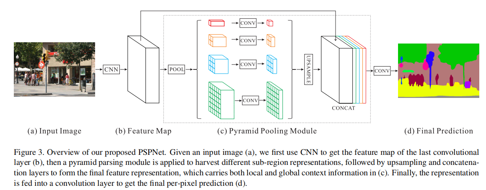
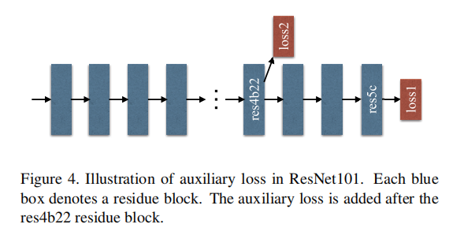

# PSPNet

---

> 论文：
>
> [[Pyramid Scene Parsing Network](https://link.zhihu.com/?target=https%3A//arxiv.org/abs/1612.01105)]
>
> 博客：
>
> [【图像分割模型】多感受野的金字塔结构—PSPNet](<https://zhuanlan.zhihu.com/p/66049804>)

## FCN存在的问题

1. mismatched relationship: 缺少上下文导致误判
2. confusion categories: 多类类间误判
3. inconspicious classes: 

## 金字塔池化

尽管ResNet的感受野在理论上已经可以达到大于输入图像尺寸，但是Zhou等人也证明了CNN的经验感受野实际上比理论值小很多

## 辅助中继监督

