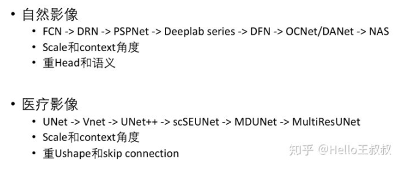

语义分割

---

> 参考博客：
>
> [超像素、语义分割、实例分割、全景分割 傻傻分不清？](<https://blog.csdn.net/electech6/article/details/85317608>)
>
> [从零开始学习的路线](<https://www.zhihu.com/question/322077321/answer/925208015>)
>
> [语义分割江湖的那些事儿——从旷视说起](<https://zhuanlan.zhihu.com/p/55263898>)

## 前言

### 概念

+ 超像素：超像素是一系列像素的集合，这些像素具有类似的颜色、纹理等特征，距离也比较近。

  

+ 语义分割：图像中每个像素赋予一个类别标签

+ 实例分割：它不需要对每个像素进行标记，它只需要找到感兴趣物体的边缘轮廓就行

+ 全景分割：语义分割和实例分割的结合。如下图所示，每个像素都被分为一类，如果一种类别里有多个实例，会用不同的颜色进行区分，我们可以知道哪个像素属于哪个类中的哪个实例。

### 发展脉络

