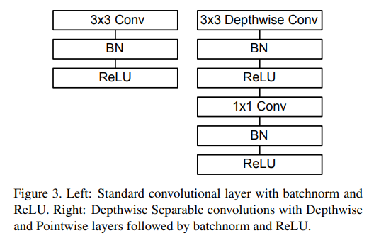
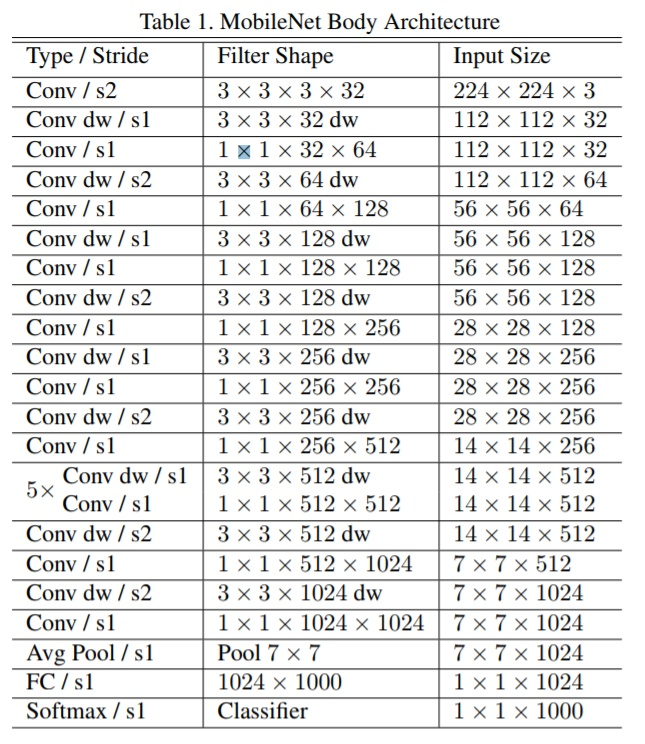
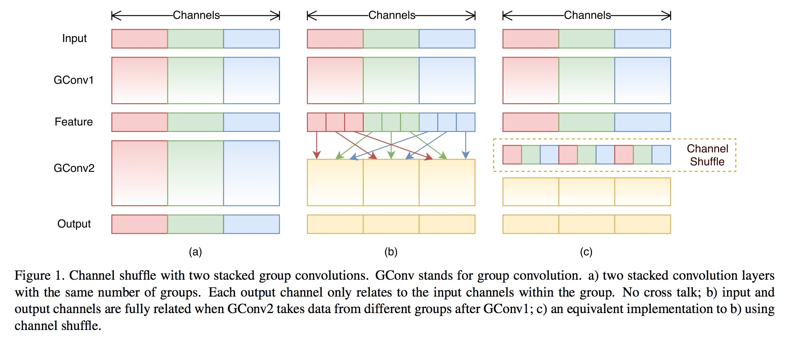
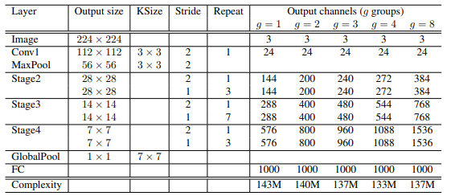
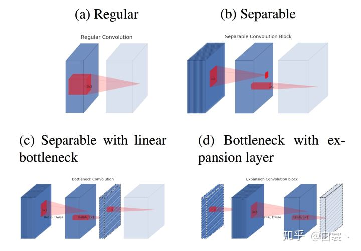
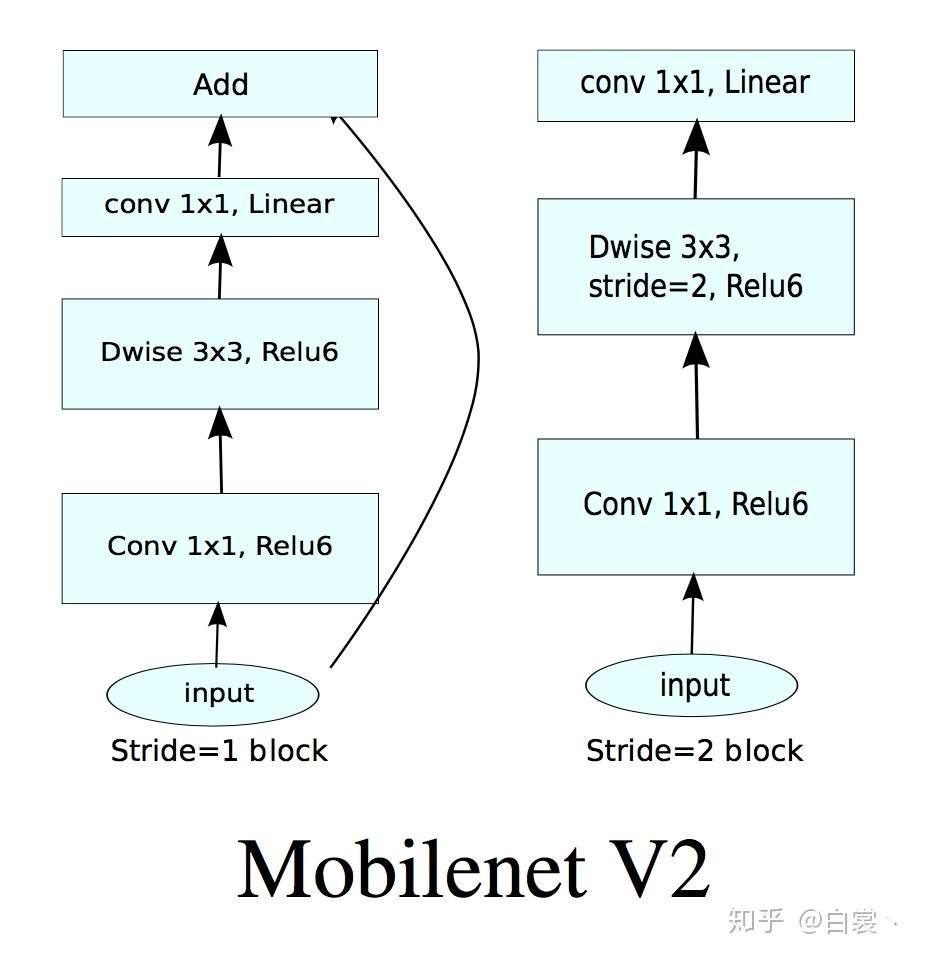
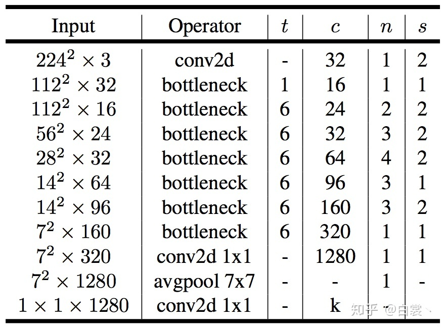
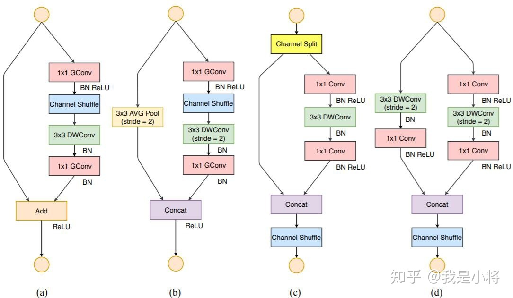

# 经典轻量化模型

---

> 参考论文：《ShuffleNet V2: Practical Guidlines for Efficient CNN Architecture Design》
>
> 参考博客：
>
> [轻量化网络ShuffleNet MobileNet v1/v2 解析](<https://zhuanlan.zhihu.com/p/35405071>)
>
> [ShuffleNetV2：轻量级CNN网络中的桂冠](<https://zhuanlan.zhihu.com/p/48261931>)
>
> [轻量化模型设计](https://www.cnblogs.com/missidiot/p/9869569.html)
>
> [CVPR 2018 高效小网络探密（上）](<https://zhuanlan.zhihu.com/p/37074222>)
>
> [CVPR 2018 高效小网络探密（下）](<https://zhuanlan.zhihu.com/p/37919669>)

## MobileNetV1

Mobilenet v1核心是把卷积拆分为Depthwise+Pointwise两部分

网络结构：

## ShuffleNetV1

主要思路是使用Group convolution和Channel shuffle改进ResNet，可以看作是ResNet的压缩版本

ResNet bottlenneck:

ShuffleNet改进：

ShuffleNet的本质是将卷积运算限制在每个Group内，这样模型的计算量取得了显著的下降。然而导致模型的信息流限制在各个Group内，组与组之间没有信息交换，这会影响模型的表示能力。因此，需要引入组间信息交换的机制，即Channel Shuffle操作。

Channel Shuffle的问题：

1. Shuffle channel在实现的时候需要大量的指针跳转和Memory set，这本身就是极其耗时的；同时又特别依赖实现细节，导致实际运行速度不会那么理想。
2. Shuffle channel规则是人工设计出来的，不是网络自己学出来的。这不符合网络通过负反馈自动学习特征的基本原则，又陷入人工设计特征的老路（如sift/HOG等）

模型结构：

## MobileNetV2

主要解决了V1在训练过程中非常容易特征退化的问题

卷积计算方式进化：

问题：相对于mobilenetV1

1. **ReLU造成的低维度数据坍塌(collapses)**：**channel少的feature map不应后接ReLU，否则会破坏feature map**
2. **没有复用特征**：在神经网络训练中如果某个卷积节点权重的值变为0就会“死掉”；**通过ResNet结构的特征复用，可以很大程度上缓解这种特征退化问题**

## ShuffleNetV2

模型设计四原则：

1. **同等通道大小最小化内存访问量** 
2. **过量使用组卷积会增加MAC**
3. **网络碎片化会降低并行度**
4. **不能忽略元素级操作**

