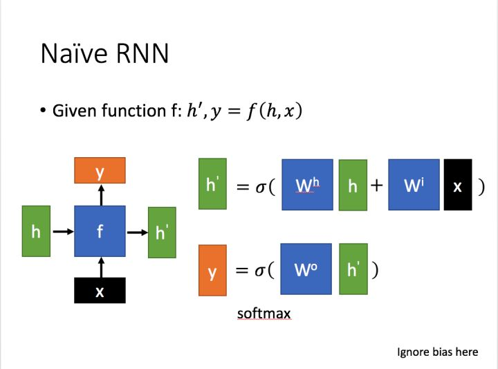
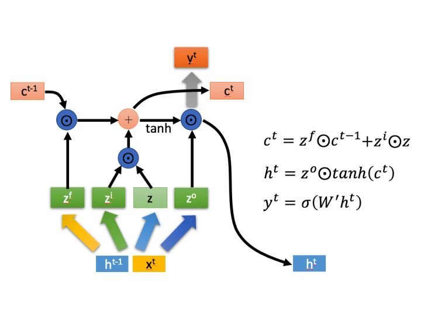
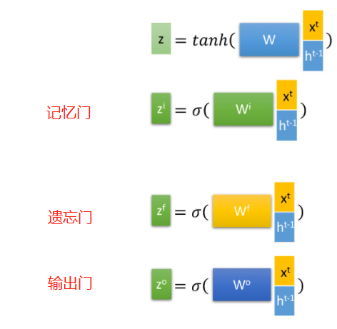
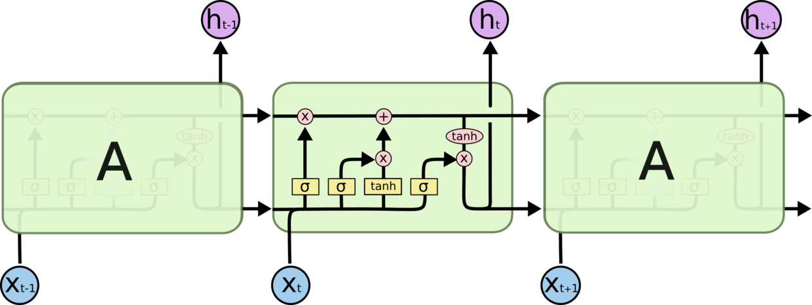
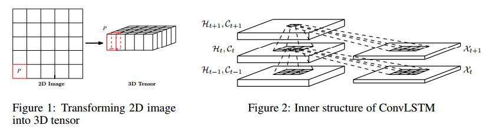

# ConvLSTM

---

> 论文：《Convolutional LSTM Network: A Machine Learning Approach for Precipitation Nowcasting》
>
> 博客：
>
> [人人都能看懂的LSTM](https://zhuanlan.zhihu.com/p/32085405)
>
> [[理解 LSTM(Long Short-Term Memory, LSTM) 网络](https://www.cnblogs.com/wangduo/p/6773601.html)]

---

## LSTM简介

原始RNN：

LSTM：简介

LSTM：详细介绍

**这里面的关于权重W的操作，跟全连接类似，因此这种lstm又可以叫FC-LSTM。这种结构非常擅长处理时序信息，也能处理空间信息**

## ConvLSTM

