# 视频目标检测

---

> 参考博客：
>
> [基于深度学习的视频目标检测综述](<https://zhuanlan.zhihu.com/p/67608224?utm_source=com.tencent.wework&utm_medium=social&utm_oi=46271733694464>)
>
> [[CVPR2019]我对Siamese网络的一点思考（SiamMask）](<https://zhuanlan.zhihu.com/p/58154634>)
>
> [Google又发大招：高效实时实现视频目标检测](<https://mp.weixin.qq.com/s/pKSrokV_j8Repa-JMloUHg?st=3969876F508ADE10C34306ABAC9D33F6587D3A96E4C8AD29B17994C923A44AF054E0405A5ADABBB39A659A20D766E9FB15134FD6471EDC10C76CC2AAFA0F9A46CCF14EA2B6E44A116F1D15D120053A3A55BD5C03EFFD84B9878C6EE6E4113D68E8907F9C9B354FA117EF9872FBB6CBBD3CB40B8C3384BFF037C4F8AAE290F287FC64BB6A2C4B03AE8AB1EE00D05424EF&vid=1688851775459386&cst=4867A030C098F103BB7B10C24E51483EC4C8F716D106FA2CA9B6669BF044A3E00FA957627D754D866542C39DCAA1824C&deviceid=a345259f-2d12-49f0-a1f0-bd07954ef8a2&version=3.0.27.2701&platform=win>)
>
> [视觉目标跟踪漫谈：从原理到应用](<https://mp.weixin.qq.com/s/K46AyMcpxCnIyh0Vawy9Dg?st=824BE5D361D964D10B7F6D71BD10DC452B2939676A13A37BF7D3C2FAFB6C5C1EA04AA03664390632DD3F6E624BB8B39611E62CF812D7CFDAA0F1B39F71BFEB622ACE6B24FDA2ED629E489E35F6CC1373D031BA2C4E6E0122120D54671BDBA31BC7A1C21C8B062276B64A9AA49CDA1099C269F42732767C887E431CCC8C7F5D349DC0F960C8F2A49D5EB8EA772F080332&vid=1688851775459386&cst=2E803068068C7E55BFDF1C98D9C562975FFA216AC37129B8D7D1FD4EA7D66C18C3DE9AC7A8F3ADC7625030CD4027066F&deviceid=a345259f-2d12-49f0-a1f0-bd07954ef8a2&version=3.0.27.2701&platform=win>)
>
> [视频中的目标检测与图像中的目标检测具体有什么区别？](<https://www.zhihu.com/question/52185576>)
>
> [多目标跟踪（MOT）入门](<https://zhuanlan.zhihu.com/p/97449724>)
>
> [基于光流的视频目标检测系列文章解读](<https://zhuanlan.zhihu.com/p/45732295>)
>
> [视频目标检测(video object detection)简单综述](https://blog.csdn.net/breeze_blows/article/details/105323491?utm_medium=distribute.pc_relevant_t0.none-task-blog-BlogCommendFromMachineLearnPai2-1.add_param_isCf&depth_1-utm_source=distribute.pc_relevant_t0.none-task-blog-BlogCommendFromMachineLearnPai2-1.add_param_isCf)

## 目标检测、视频目标检测、目标跟踪

目标跟踪通常可分为单目标跟踪和多目标跟踪两类，解决的任务和视频目标检测相同的点在于都需要对每帧图像中的目标精准定位，<u>不同点在于目标跟踪不考虑目标的识别问题</u>。

## 目标跟踪

**"万物跟踪"**： 通常来说，跟踪的目标是视频帧或图像中的某个区域或物体，不需要其语义信息（类别等）

跟踪是在一个视频的后续帧中找到在当前帧中定义的感兴趣物体 (object of interest) 的过程

给定第一帧感兴趣物体的位置，寻找后续帧感兴趣物体的位置

> de facto rules：在同一段视频中，相同的物体在前后两帧中的尺寸和空间位置不会发生巨大的变化

1. **“找到”：如何locate**；candidate generation，通常被表述为候选框生成
2. **“感兴趣物体”：如何shape**；特征表达/提取
3. **“后续帧”：如何distinguish**；决策，主要解决匹配问题（相似度最大）

> 跟踪算法的应用：作为检测算法的补充，其可以在视频或连续有语义关联的图像中提供目标的空间位置，降低整个系统的复杂度（例如检测仅应用于视频第一帧识别出目标，以及后续帧中的某些帧来确定目标位置，然后在其余帧中应用跟踪确定目标位置）

跟踪的系统流程：

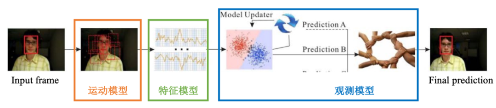

### 运动模型

候选框生成：

+ 推理过程：用于预测当前帧的目标位置；我们只需要在上一帧预测的目标位置附近生成和其尺寸近似的候选框，从而提高整个跟踪系统的效率
+ 训练过程：通常在基于判别式方法的跟踪算法中需要，属于跟踪系统学习如何区分目标和非目标的过程；又被称作“正负样本生成”

系统架构与分类：

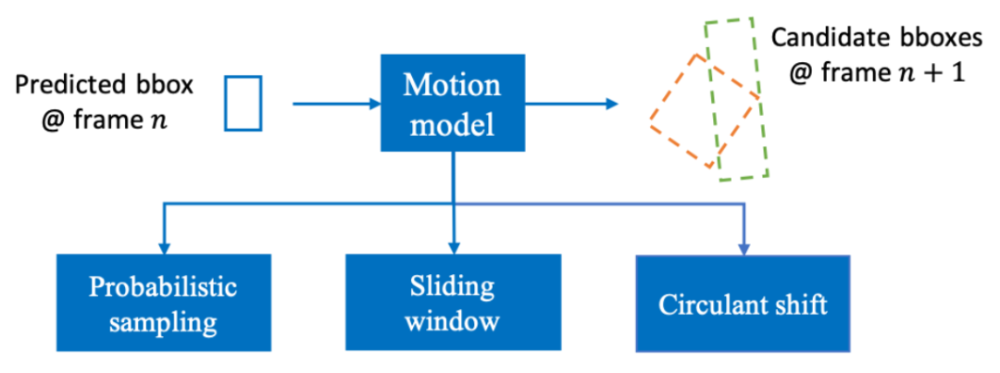

位置变化、尺度变化、和旋转等

1. 概率采样：通过仿射变换生成候选框；参数都是符合某种概率分布（通常是高斯分布）的随机变量，而采样则体现在生成不同数量的候选框

2. 滑窗：当前帧中按一定的空间间隔移动，每次移动后覆盖的图像中的相应像素即为生成的候选框

3. 循环移位：

   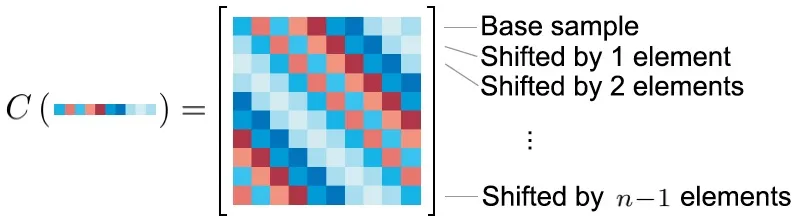

### 特征模型

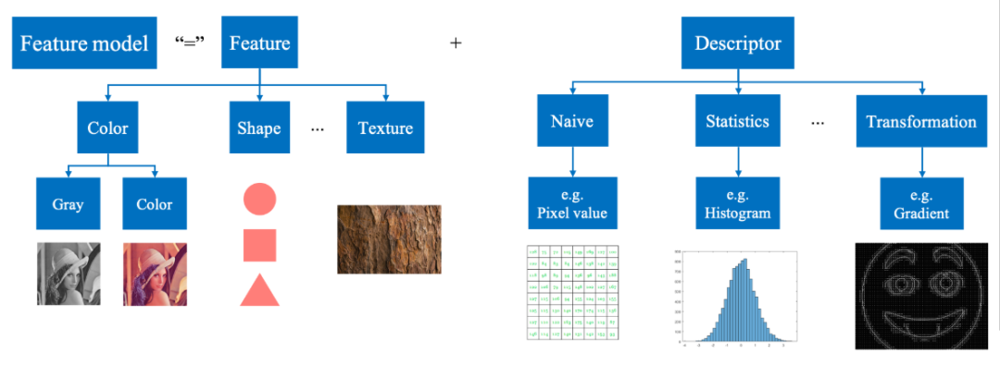

### 观测模型

匹配问题-->相似度度量

被比较的个体通常是候选框和前一帧的预测结果（或者是ground truth），而衡量机制可以被抽象成距离 (distance)

+ 常用的空间距离有Minkowski distance（Manhattan distance和Euclidean distance是其特殊情况）

+ 常用的概率分布距离有Kullback–Leibler (KL) 散度、Bhattacharyya distance、交叉熵、以及Wasserstein distance等

观测模型的系统架构

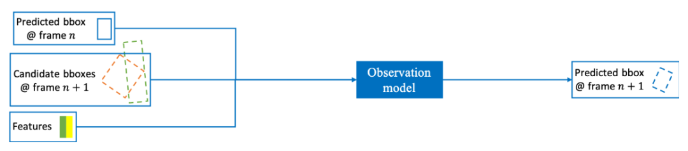

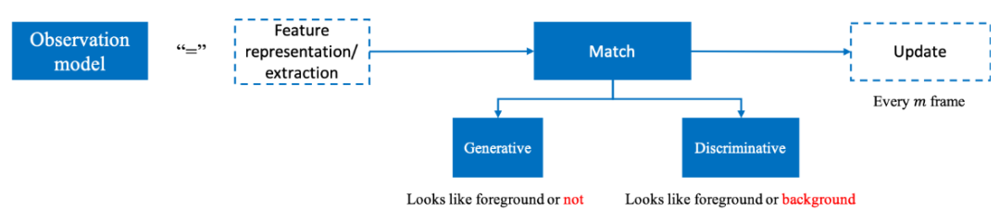

匹配方法的分类：

+ 生成式方法：使用数学工具拟合目标的图像域特征，并在当前帧寻找拟合结果最佳（通常是拟合后重建误差最小的）的候选框
+ 判别式方法：将目标视为前景，将不包含目标的区域视为背景，从而将匹配问题转换成了将目标从背景中分离的问题

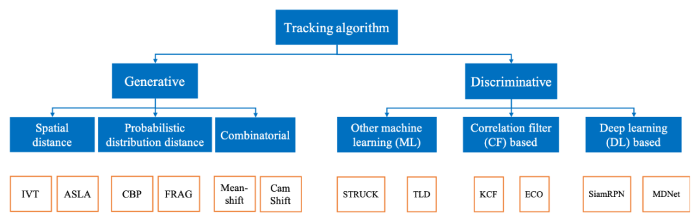

生成式方法：

1. 空间距离：计算当前帧候选框的像素灰度值与上一帧预测目标的像素灰度值之间的Euclidean distance
2. 概率分布距离：计算当前帧候选框的颜色直方图分布与上一帧预测目标的颜色直方图分布之间的Bhattacharyya distance
3. 综合：在每一帧中利用上一帧预测目标的颜色直方图分布，计算该帧中相应位置的像素的颜色直方图分布，然后进行聚类得到其分布的均值，其对应的像素位置是该帧中预测目标的中心位置，然后加上候选框宽高等信息即可得到当前帧预测目标的空间位置

判别式方法：

1. 经典机器学习方法：目标作为前景从背景中提取出来
2. 相关滤波方法：应用相关操作计算候选框与预测目标匹配度的方法
3. 深度学习方法：目标作为前景从背景中提取出来

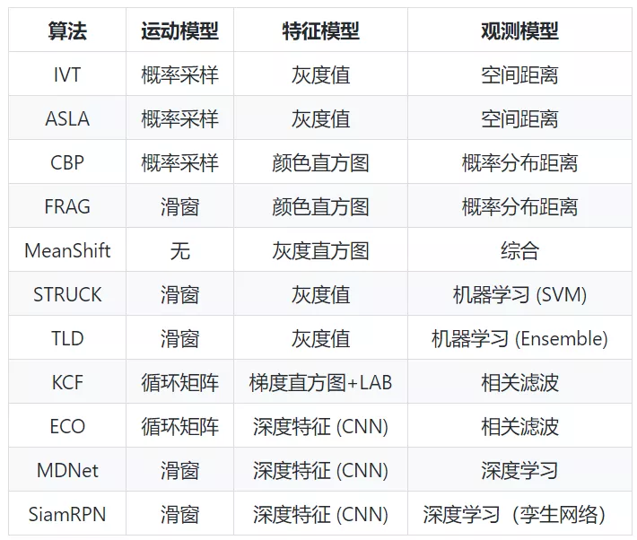

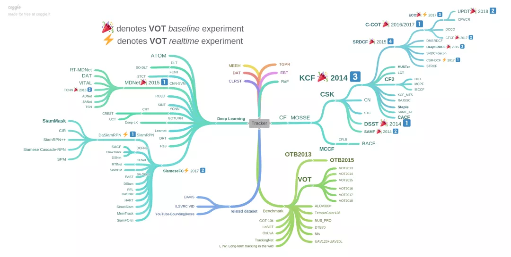

## 基于深度学习的视频目标检测

总体上分为两类：

+ 基于检测和跟踪的深度学习视频目标检测方法
+ 基于光流等动态信息的深度学习目标检测算法

视频目标检测中的问题：

+ 如何保持视频中目标的时空一致性
+ 问题：运动模糊、虚焦、遮挡、外观变化、尺度变化

### 思路一： 检测与跟踪结合

代表：T-CNN

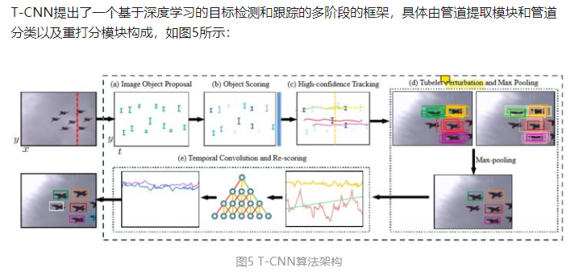

视频目标追踪任务学习到的时间信息与静态目标检测任务学习到的空间特征相结合

管道提取：

+ 静态图像的目标检测；
+ R-CNN对目标框进行分类别的打分；
+ 对高置信度的框进行跟踪

重打分：TCN时域卷积

局限性：

1. 依赖视频目标追踪算法的性能；
2. 算法过程较为复杂，实时性不够高；
3. 并没有直接的针对模糊、运动等视频信息的进行利用并加以解决视频中为出现类似的实际情况。

### 思路二： 利用运动信息

直接利用视频中的运动信息进行视频目标检测

目前使用的比较多的运动信息是光流

代表：

+ Flow-Guided Feature Aggregation-FlowNet
+ Association LSTM
+ Aligned Spatial-Temporal Memory
+ MANet

算法一：FGFA

1. 由光流提取和特征融合两个模块构成
2. 特征组合：每次提取当前帧到相邻帧的光流，并将相邻帧的特征按照提取到的光流和当前帧的特征组合在一起
3. 特征融合：将当前特征和与其相邻的多个特征进行融合

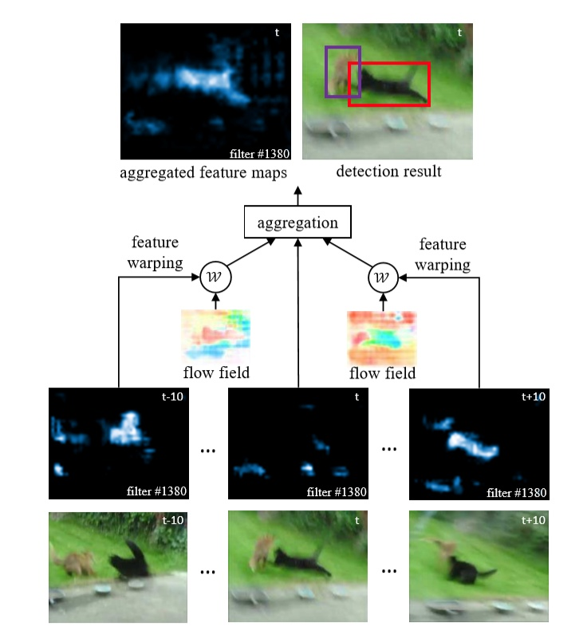

不足：

1. 计算多帧的光流然后进行特征融合的计算量非常大；
2. 特征融合的权重是一个cosine权重，该方法比较简单粗暴，有提升的空间

算法二：Association LSTM：

1. 在线利用运动信息
2. SSD和LSTM组成
3. SSD在视频的每一帧进行目标检测，按照SSD检测结果提取目标的特征，然后进行堆叠，送入LSTM
4. LSTM对每一帧处理完后，除了边框的Regression Error，还会在相邻两帧LSTM的输出结果上额外计算一个Association Error

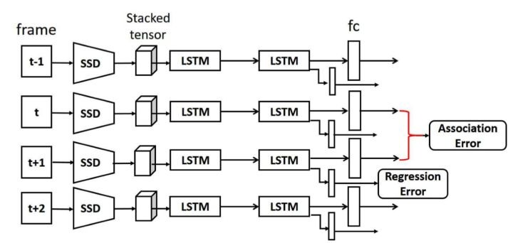

局限性：

1. 严重依赖与进行定位检测跟踪算法的性能；
2. 相邻帧所反映的目标变化信息有局限性，只能反映出短期的运动信息，而对长时间的运动信息无能为力

算法三：Aligned Spatial-Temporal Memory

1. 对多帧体现的运动信息进行学习
2. STMM是一个双向的循环卷积网络
3. 对于当前帧，通过在相邻多个连续帧上进行卷积堆栈以获得保留了空间特性的特征，然后将其送入STMM模块
4. 可以学习到长期的运动信息，从而提升视频目标检测算法的性能

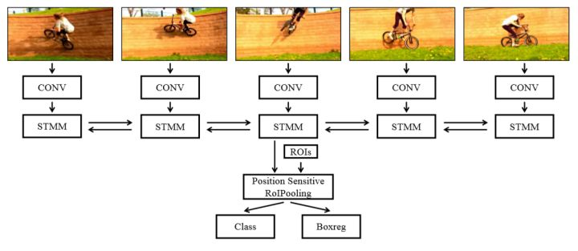

缺陷：

1. LSTM算法并行程度不高，训练效率受限；
2. 相邻帧所反映的目标变化信息有局限性，因为本文虽然学习了长期的运动信息，但是从相距比较远的帧的运动信息还是通过相邻帧一步一步从STMM单元传送到当前帧的，这样是一种间接的方式，效率并不算太高。

算法四：MANet

1. 试图学习多个相邻帧所以先出的目标运动信息
2. 相比较于STMM方法，本文还使用了多帧特征融合

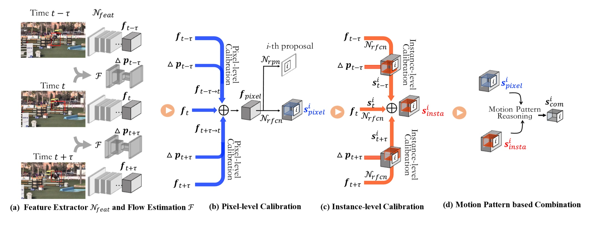

### 作者实验

数据集：

1. ImageNet VID数据集
2. YTO数据集：ImageNet VID子集的弱注释

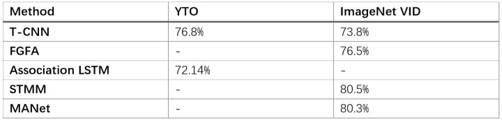

### 小结

热点方向：

1. **学习帧之间的光流等运动信息**：因为运动信息是保持视频目标时空一致性的重要判别信息，所以算法利用离线或者在线的方式进行学习，离线学习方法不能反向传播就修正，而在线光流学习的方法可以在训练期间进行修正，因此会有更好的性能；
2. **对多帧特征进行融合**：这种方式会更好的利用视频序列中帧之间的运动所产生的变化信息。目前阶段视频目标检测算法的性能已经不错，而计算量和实时性是一个制约其应用的亟需解决的问题。

## Looking Fast and Slow

