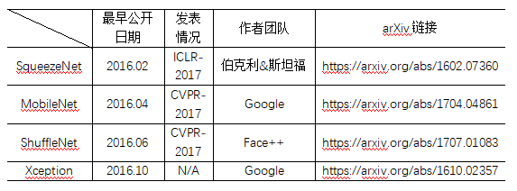

# 轻量化模型

---

> [纵览轻量化卷积神经网络：SqueezeNet、MobileNet、ShuffleNet、Xception](<https://www.jiqizhixin.com/articles/2018-01-08-6>)

---

## SqueezeNet

> 《SqueezeNet：AlexNet-level accuracy with 50x fewer parameters and <0.5MB》

本文的新意是 squeeze，squeeze 在 SqueezeNet 中表示一个 squeeze 层，该层采用 1*1 卷积核对上一层 feature map 进行卷积，主要目的是减少 feature map 的维数

