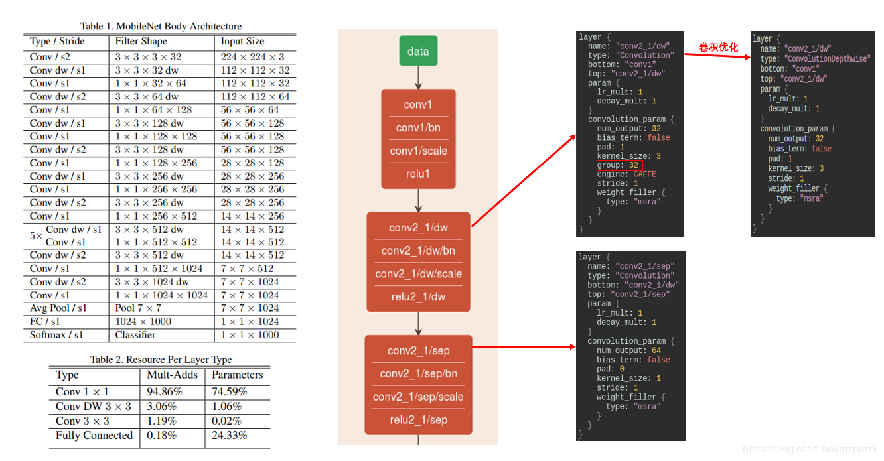
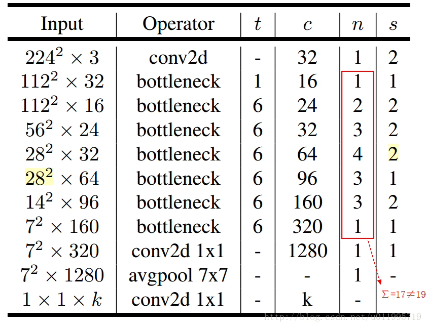
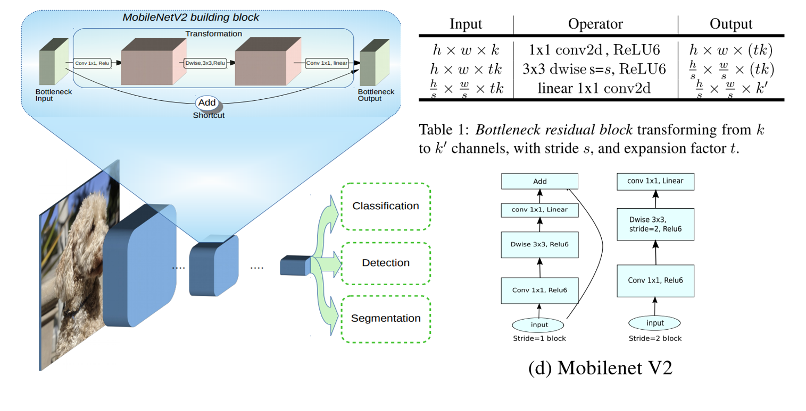
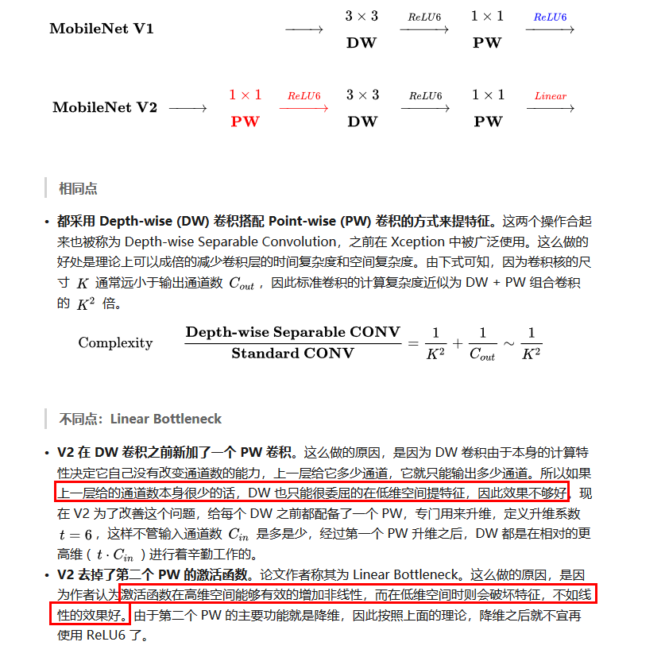
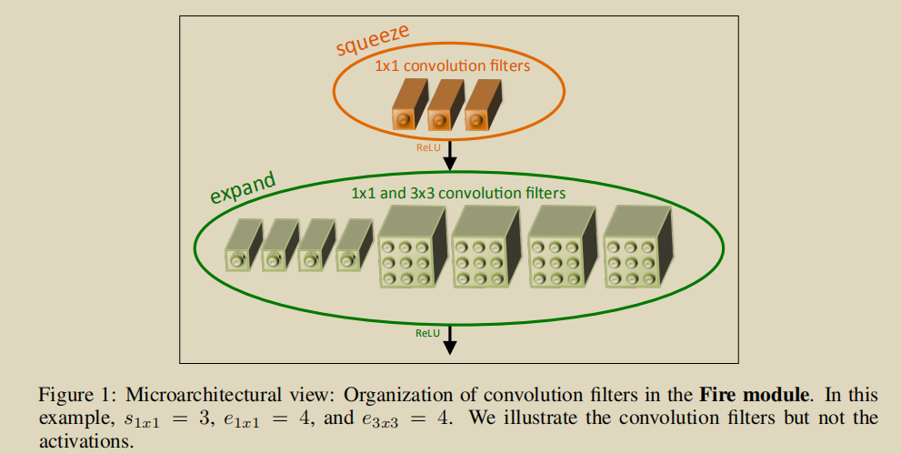
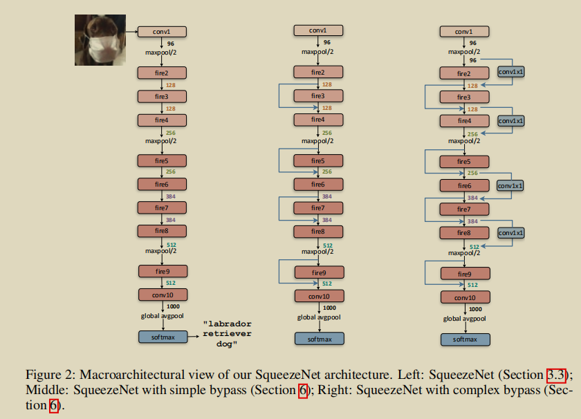
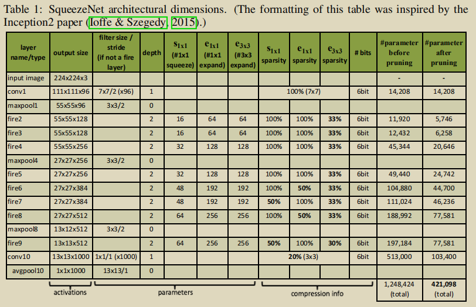

# 轻量化模型

---

> [纵览轻量化卷积神经网络：SqueezeNet、MobileNet、ShuffleNet、Xception](<https://www.jiqizhixin.com/articles/2018-01-08-6>)
>
> [轻量化网络ShuffleNet MobileNet v1/v2 解析](<https://zhuanlan.zhihu.com/p/35405071>)
>
> 

---

## MobileNet

> [MobileNetV1 & MobileNetV2 简介](<https://blog.csdn.net/mzpmzk/article/details/82976871>)

### MobileNetV1

### MobileNetV2

其中：t表示“扩张”倍数，c表示输出通道数，n表示重复次数，s表示步长stride。

stride = 1: 有shortcut;  

stride = 2: 没有shortcut

### 两者的区别

## SqueezeNet

> 《SqueezeNet：AlexNet-level accuracy with 50x fewer parameters and <0.5MB》

本文的新意是 squeeze，squeeze 在 SqueezeNet 中表示一个 squeeze 层，该层采用 1*1 卷积核对上一层 feature map 进行卷积，主要目的是减少 feature map 的维数

设计策略：

1. 将3x3卷积替换为1x1卷积——squeeze net
2. 减少3x3卷积的输入channel数量
3. 在较深层进行down sample 使卷积层具有较大的activation map

### Fire Module:

一般squeeze layer 1x1卷积数量小于expand layer卷积总数量，因此相当于减小3x3卷积的输入channel

### squeeze模型架构

其他细节：

